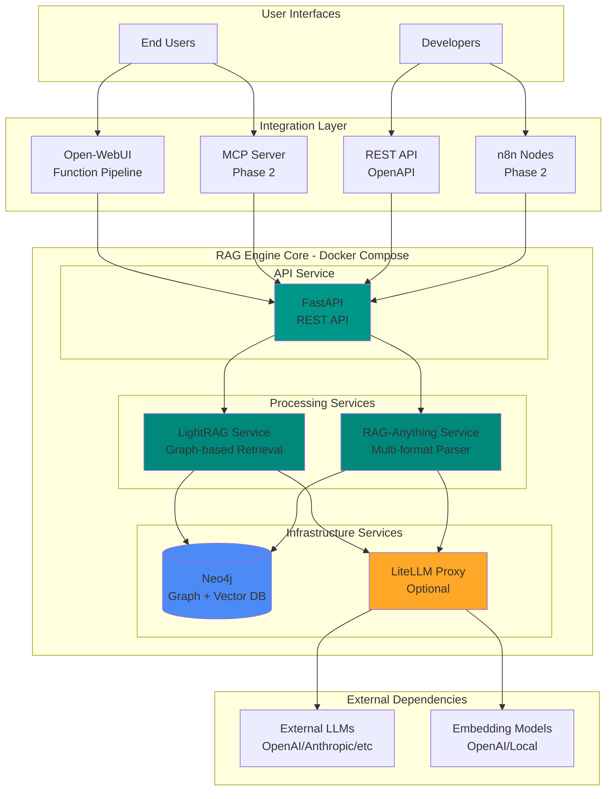
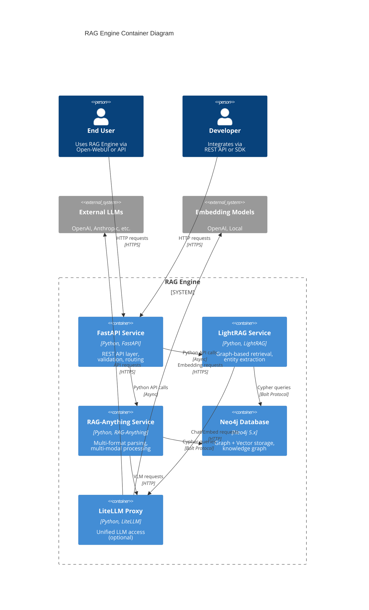
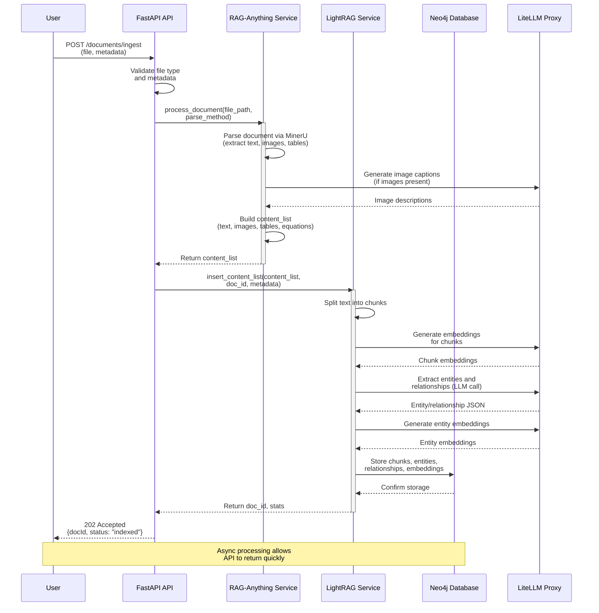
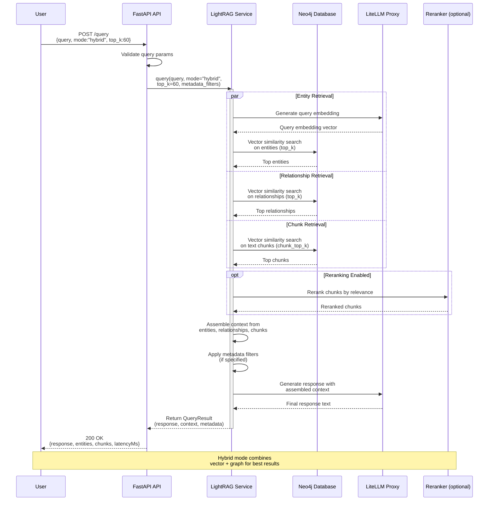
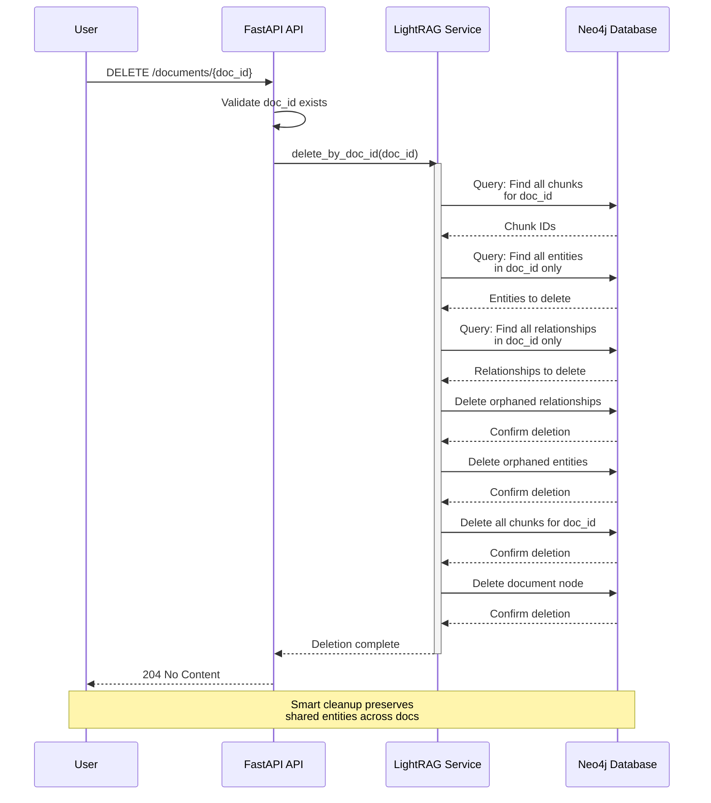
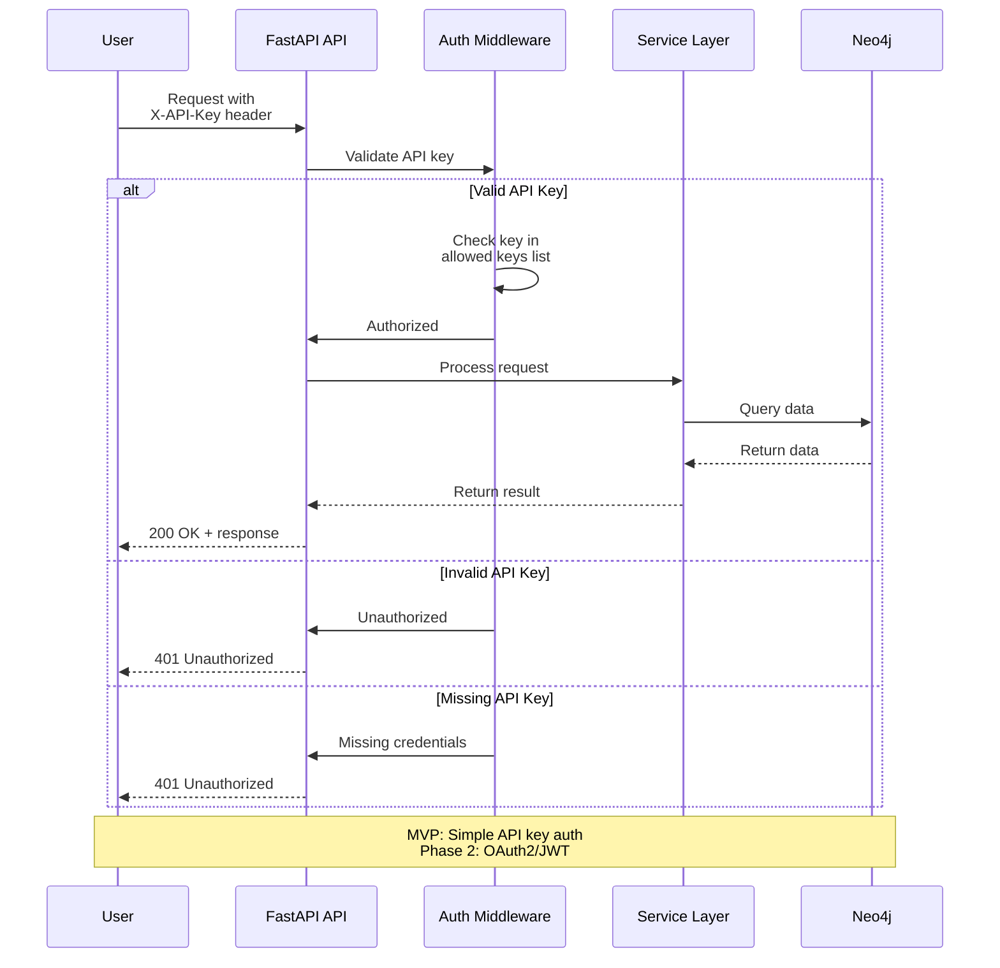
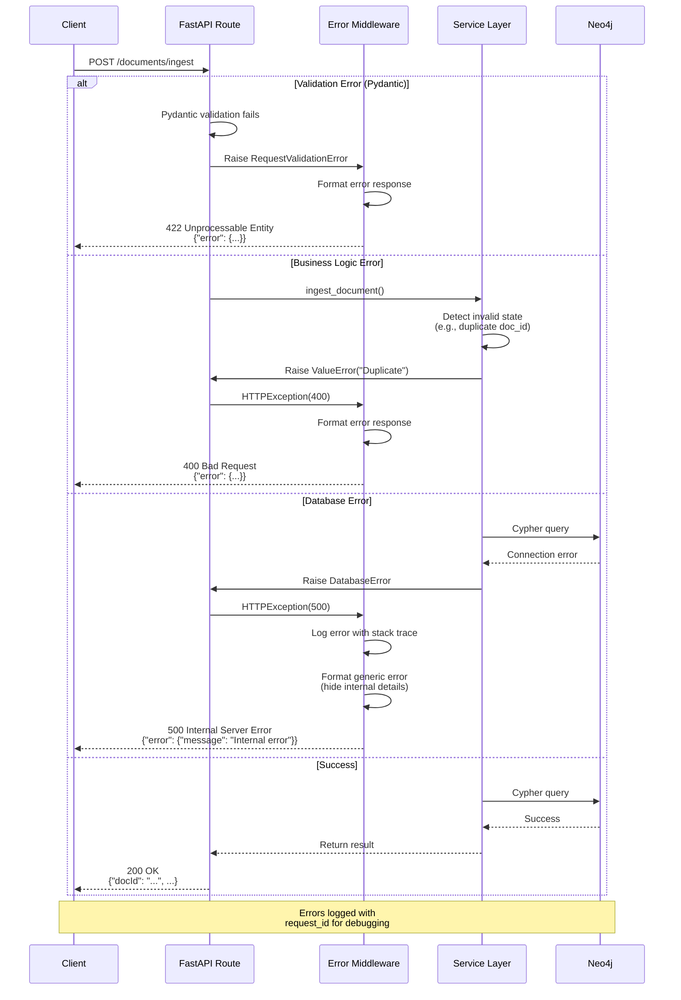

# RAG Engine Full-Stack Architecture Document

## Introduction

This document outlines the complete full-stack architecture for RAG Engine, a production-ready Retrieval-Augmented Generation framework designed as an enabler for easy-to-deploy knowledge management assistants. It serves as the single source of truth for AI-driven development, ensuring consistency across the entire technology stack.

This architecture integrates LightRAG (graph-based retrieval) and RAG-Anything (multi-format document processing) into a unified, Docker-based system optimized for ultimate RAG performance with operational excellence.

### Starter Template or Existing Project

**Base Project**: This is a greenfield project built on top of:
- **LightRAG** (https://github.com/HKUDS/LightRAG) - Graph-based retrieval engine with Neo4j integration
- **RAG-Anything** (https://github.com/HKUDS/RAG-Anything) - Multi-modal document processing framework

**Constraints**:
- Must maintain compatibility with LightRAG's existing API surface
- Neo4j graph database is mandatory for LightRAG functionality
- Python 3.11+ required for LightRAG/RAG-Anything compatibility
- Docker Compose deployment model as primary installation method

### Change Log

| Date | Version | Description | Author |
|------|---------|-------------|--------|
| 2025-10-15 | 1.0 | Initial architecture document | Winston (Architect Agent) |

---

## High Level Architecture

### Technical Summary

RAG Engine implements a **microservices-based architecture** deployed via **Docker Compose**, combining best-in-class open-source RAG technologies (LightRAG, RAG-Anything) with a **FastAPI REST API layer** for universal access. The system uses **Neo4j** as both vector and graph storage to enable sophisticated entity-relationship retrieval, with **LiteLLM** proxy for flexible LLM access. Documents are processed through **RAG-Anything's multi-format parser**, indexed into LightRAG's **knowledge graph**, and served through multiple interfaces: **Open-WebUI function pipelines**, **MCP server protocol**, **REST API**, and future **n8n custom nodes** and **Pydantic SDK**. Deployment targets **Linux/macOS/Windows** via Docker containers with optional **GPU acceleration** for document processing. This architecture achieves "ultimate RAG" quality through graph-augmented retrieval while maintaining **single-command deployment simplicity** for the target user base of self-hosters and developers.

### Platform and Infrastructure Choice

**Platform:** Docker-based Local Deployment (Primary) with Cloud-agnostic Design

**Deployment Philosophy**:
- **Primary**: Docker Compose for local/self-hosted deployment (MVP target)
- **Secondary**: Kubernetes-ready architecture for Phase 2 scale-out
- **No vendor lock-in**: All components are open-source and portable

**Key Services:**
- **Containerization**: Docker 24.0+ and Docker Compose V2
- **Graph & Vector Database**: Neo4j 5.x (Community Edition for MVP, Enterprise optional)
- **Document Processing**: RAG-Anything with MinerU parser
- **RAG Framework**: LightRAG with graph-based retrieval
- **LLM Proxy**: LiteLLM (optional, for enterprise LLM access)
- **Storage**: Local volumes for persistence, with backup strategy via Neo4j dumps

**Deployment Host and Regions:**
- **Target**: Self-hosted on user hardware (home servers, workstations, VPS)
- **Minimum**: 8GB RAM, 4 CPU cores, 50GB storage
- **Recommended**: 16GB RAM, 8 CPU cores, 100GB+ storage
- **Networks**: Internal Docker network for service communication
- **External Access**: Optional reverse proxy (Nginx/Traefik) for remote access

**Rationale**:
- Privacy-first for sensitive knowledge bases
- Zero operational costs (excluding optional LLM API usage)
- Aligns with Open-WebUI community's self-hosting culture
- Simple deployment reduces barrier to adoption
- Cloud-agnostic design enables future managed offerings

### Repository Structure

**Structure:** Monorepo with service-oriented packages

**Monorepo Tool:** None required for MVP (simple Python project structure with shared modules)

**Rationale**: A lightweight monorepo without complex tooling fits the Python ecosystem better than JavaScript-style monorepo tools. All services share common Python dependencies via pip/poetry, and inter-service communication is via REST APIs and shared data models.

**Package Organization:**

```
rag-engine/
├── services/           # Microservice containers
│   ├── api/           # FastAPI REST API
│   ├── lightrag/      # LightRAG integration service
│   ├── rag-anything/  # Document processing service
│   └── litellm/       # Optional LLM proxy
├── shared/            # Shared Python modules
│   ├── models/        # Pydantic data models
│   ├── config/        # Configuration schemas
│   └── utils/         # Shared utilities
├── integrations/      # Pre-built integrations
│   ├── openwebui/     # Open-WebUI function pipeline
│   ├── mcp/           # MCP server (Phase 2)
│   └── n8n/           # n8n nodes (Phase 2)
└── infrastructure/    # Docker and deployment configs
```

### High Level Architecture Diagram



### Architectural Patterns

- **Microservices Architecture:** Containerized services with clear boundaries (API, LightRAG, RAG-Anything, Neo4j, LiteLLM) - _Rationale:_ Enables independent scaling, isolated failure domains, and technology flexibility while maintaining operational simplicity via Docker Compose

- **Repository Pattern:** Abstract data access to Neo4j through LightRAG's storage layer - _Rationale:_ Enables testing with mock storage and potential future migration to alternative graph databases

- **API Gateway Pattern:** FastAPI service as single entry point routing to LightRAG and RAG-Anything - _Rationale:_ Centralized authentication, request validation, and consistent error handling across all clients

- **Service Layer Pattern:** Business logic encapsulated in service classes separate from API routes - _Rationale:_ Promotes reusability and testability of core RAG operations

- **Adapter Pattern:** Unified interface abstracting LightRAG and RAG-Anything implementation details - _Rationale:_ Allows swapping or upgrading underlying frameworks without breaking API contracts

- **Event-Driven Processing:** Async document ingestion with status tracking - _Rationale:_ Non-blocking API responses for long-running document processing operations

- **Configuration as Code:** Environment-based config with validation via Pydantic - _Rationale:_ Type-safe configuration prevents runtime errors and provides clear documentation

---

## Tech Stack

### Technology Stack Table

| Category | Technology | Version | Purpose | Rationale |
|----------|-----------|---------|---------|-----------|
| **Backend Language** | Python | 3.11+ | Core application runtime | Required by LightRAG and RAG-Anything; async/await support; rich ecosystem for ML/AI |
| **Backend Framework** | FastAPI | 0.115+ | REST API server | Async support, automatic OpenAPI generation, high performance, Pydantic integration |
| **RAG Framework** | LightRAG | Latest (0.x) | Graph-based retrieval engine | Graph-augmented retrieval, entity extraction, multi-hop reasoning |
| **Document Processor** | RAG-Anything | Latest (0.x) | Multi-format document parsing | Handles PDF, Office, images, tables, equations via MinerU integration |
| **Graph + Vector DB** | Neo4j | 5.x (Community) | Knowledge graph and vector storage | Native graph + vector support, production-proven, LightRAG requirement |
| **LLM Proxy** | LiteLLM | Latest | Unified LLM interface | OpenAI-compatible API for 100+ LLM providers, cost tracking, fallback logic |
| **Web Server** | Uvicorn | Latest | ASGI server for FastAPI | High-performance async server, production-ready |
| **Embedding Models** | sentence-transformers | Latest | Local embeddings (MVP) | Open-source, good quality, no API costs for MVP |
| **Alternative Embeddings** | OpenAI text-embedding-3 | Latest | Enterprise embeddings (optional) | Higher quality, requires API key, accessed via LiteLLM |
| **Reranking** | Jina reranker / MS Marco | Latest | Result reranking | Improves retrieval precision, optional performance boost |
| **Document Parser** | MinerU | 2.0+ | PDF/Office/image parsing | High-fidelity extraction, OCR support, GPU acceleration |
| **API Documentation** | Swagger UI / ReDoc | Latest (auto-generated) | Interactive API docs | Built-in FastAPI feature, no additional setup |
| **Validation** | Pydantic | 2.x | Data validation and serialization | Type safety, automatic validation, OpenAPI schema generation |
| **Testing Framework** | pytest | Latest | Unit and integration tests | Python standard, async support, fixture-based, plugin ecosystem |
| **Test Coverage** | pytest-cov | Latest | Code coverage reporting | Ensures test completeness |
| **Async Testing** | pytest-asyncio | Latest | Async test support | Required for FastAPI async route testing |
| **HTTP Testing** | httpx | Latest | API integration tests | Async HTTP client, TestClient support for FastAPI |
| **Container Runtime** | Docker | 24.0+ | Service containerization | Industry standard, cross-platform, easy distribution |
| **Container Orchestration** | Docker Compose | V2 | Multi-container orchestration | Single-command deployment, environment management |
| **Configuration Management** | python-dotenv | Latest | Environment variable loading | .env file support for configuration |
| **Logging** | structlog | Latest | Structured logging | JSON logs, context preservation, easy parsing for monitoring |
| **Monitoring** | Prometheus + Grafana | Latest (Phase 2) | Metrics and dashboards | Industry standard, Neo4j metrics integration |
| **CI/CD** | GitHub Actions | N/A | Automated testing and Docker builds | Free for public repos, Docker registry integration |
| **Documentation** | MkDocs | Latest | Project documentation | Markdown-based, auto-generated from code, GitHub Pages deployment |

**NOTE ON NETWORK PORTS**: All services communicate internally via Docker network. Port bindings are configurable via `.env` file:
- Neo4j: Default 7687 (Bolt), 7474 (HTTP) - **USER CONFIGURABLE**
- FastAPI: Default 8000 - **USER CONFIGURABLE**
- LightRAG Server (optional): Default 9621 - **USER CONFIGURABLE**
- LiteLLM: Default 4000 - **USER CONFIGURABLE**

Documentation must emphasize these are EXAMPLE ports and can be changed in `.env` to avoid conflicts.

---

## Data Models

### Document

**Purpose:** Represents an ingested document with processing status and metadata

**Key Attributes:**
- `doc_id: string` - Unique document identifier (auto-generated or user-provided)
- `file_path: string` - Original file path or identifier
- `content_type: string` - MIME type or format (pdf, docx, markdown, etc.)
- `status: string` - Processing status (pending, processing, indexed, failed)
- `metadata: dict` - Custom metadata fields (author, department, date, tags, etc.)
- `created_at: datetime` - Timestamp of ingestion
- `updated_at: datetime` - Last processing update
- `chunk_count: integer` - Number of text chunks created
- `entity_count: integer` - Number of entities extracted
- `error_message: string?` - Error details if processing failed

#### TypeScript Interface

```typescript
interface Document {
  docId: string;
  filePath: string;
  contentType: string;
  status: 'pending' | 'processing' | 'indexed' | 'failed';
  metadata: Record<string, any>;
  createdAt: string; // ISO 8601
  updatedAt: string;
  chunkCount: number;
  entityCount: number;
  errorMessage?: string;
}
```

#### Relationships

- **HAS_CHUNKS** → TextChunk (1:many)
- **CONTAINS_ENTITIES** → Entity (many:many)
- **BELONGS_TO** → KnowledgeBase (many:1)

---

### Entity

**Purpose:** Represents a knowledge graph entity extracted from documents (person, organization, concept, etc.)

**Key Attributes:**
- `entity_name: string` - Canonical entity name
- `entity_type: string` - Entity category (person, organization, concept, etc.)
- `description: string` - LLM-generated entity description
- `source_ids: list[string]` - Document IDs where entity appears
- `metadata: dict` - Entity-specific metadata
- `embedding: vector` - Embedding vector for similarity search
- `created_at: datetime` - First extraction timestamp
- `updated_at: datetime` - Last update timestamp

#### TypeScript Interface

```typescript
interface Entity {
  entityName: string;
  entityType: string;
  description: string;
  sourceIds: string[];
  metadata: Record<string, any>;
  embedding?: number[]; // Optional for API responses
  createdAt: string;
  updatedAt: string;
}
```

#### Relationships

- **MENTIONED_IN** → Document (many:many)
- **RELATED_TO** → Entity (many:many) with relationship properties
- **PART_OF** → TextChunk (many:many)

---

### Relationship

**Purpose:** Represents semantic connections between entities in the knowledge graph

**Key Attributes:**
- `src_entity: string` - Source entity name
- `tgt_entity: string` - Target entity name
- `relationship_type: string` - Relationship description or type
- `description: string` - LLM-generated relationship summary
- `keywords: string` - Keywords describing the relationship
- `weight: float` - Relationship strength (0.0-1.0)
- `source_ids: list[string]` - Documents supporting this relationship
- `embedding: vector` - Embedding vector for relationship
- `created_at: datetime` - First extraction timestamp
- `updated_at: datetime` - Last update timestamp

#### TypeScript Interface

```typescript
interface Relationship {
  srcEntity: string;
  tgtEntity: string;
  relationshipType: string;
  description: string;
  keywords: string;
  weight: number;
  sourceIds: string[];
  embedding?: number[];
  createdAt: string;
  updatedAt: string;
}
```

#### Relationships

- **CONNECTS** → (Entity, Entity)
- **SUPPORTED_BY** → Document (many:many)

---

### TextChunk

**Purpose:** Represents a text segment from a document, used for retrieval

**Key Attributes:**
- `chunk_id: string` - Unique chunk identifier
- `doc_id: string` - Parent document ID
- `content: string` - Actual text content
- `chunk_index: integer` - Position within document
- `token_count: integer` - Number of tokens in chunk
- `embedding: vector` - Embedding vector for similarity search
- `metadata: dict` - Chunk-specific metadata (page number, section, etc.)
- `created_at: datetime` - Creation timestamp

#### TypeScript Interface

```typescript
interface TextChunk {
  chunkId: string;
  docId: string;
  content: string;
  chunkIndex: number;
  tokenCount: number;
  embedding?: number[];
  metadata: Record<string, any>;
  createdAt: string;
}
```

#### Relationships

- **BELONGS_TO** → Document (many:1)
- **CONTAINS** → Entity (many:many)
- **NEXT_CHUNK** → TextChunk (1:1, optional for sequence)

---

### QueryResult

**Purpose:** Represents the result of a RAG query, including context and generated response

**Key Attributes:**
- `query_id: string` - Unique query identifier
- `query_text: string` - Original user query
- `mode: string` - Retrieval mode (local, global, hybrid, naive, mix)
- `response: string` - Generated response from LLM
- `context_chunks: list[TextChunk]` - Retrieved text chunks
- `entities: list[Entity]` - Relevant entities
- `relationships: list[Relationship]` - Relevant relationships
- `metadata: dict` - Query metadata (filters, top_k, etc.)
- `latency_ms: integer` - Total query latency
- `created_at: datetime` - Query timestamp

#### TypeScript Interface

```typescript
interface QueryResult {
  queryId: string;
  queryText: string;
  mode: 'local' | 'global' | 'hybrid' | 'naive' | 'mix';
  response: string;
  contextChunks: TextChunk[];
  entities: Entity[];
  relationships: Relationship[];
  metadata: Record<string, any>;
  latencyMs: number;
  createdAt: string;
}
```

#### Relationships

- **RETRIEVES** → (TextChunk[], Entity[], Relationship[])

---

## API Specification

### REST API Specification

```yaml
openapi: 3.0.0
info:
  title: RAG Engine API
  version: 1.0.0
  description: |
    Production-ready RAG API with graph-based retrieval, multi-format document processing,
    and multiple integration interfaces (Open-WebUI, MCP, n8n, REST).
  contact:
    name: RAG Engine Project
    url: https://github.com/your-org/rag-engine

servers:
  - url: http://localhost:8000
    description: Local development server
  - url: http://your-domain.com/api
    description: Production server (user-deployed)

tags:
  - name: documents
    description: Document ingestion and management
  - name: queries
    description: RAG query operations
  - name: knowledge-graph
    description: Knowledge graph exploration
  - name: health
    description: System health and status

paths:
  /health:
    get:
      summary: Health check endpoint
      tags: [health]
      responses:
        '200':
          description: Service is healthy
          content:
            application/json:
              schema:
                type: object
                properties:
                  status:
                    type: string
                    example: "healthy"
                  services:
                    type: object
                    properties:
                      neo4j:
                        type: string
                        example: "connected"
                      lightrag:
                        type: string
                        example: "ready"
                      rag_anything:
                        type: string
                        example: "ready"

  /documents/ingest:
    post:
      summary: Ingest a new document
      tags: [documents]
      requestBody:
        required: true
        content:
          multipart/form-data:
            schema:
              type: object
              required:
                - file
              properties:
                file:
                  type: string
                  format: binary
                  description: Document file to ingest
                metadata:
                  type: object
                  additionalProperties: true
                  description: Custom metadata fields (JSON)
                doc_id:
                  type: string
                  description: Optional custom document ID
                parse_method:
                  type: string
                  enum: [auto, ocr, txt]
                  default: auto
                  description: Document parsing method
      responses:
        '202':
          description: Document accepted for processing
          content:
            application/json:
              schema:
                $ref: '#/components/schemas/Document'
        '400':
          $ref: '#/components/responses/BadRequest'
        '500':
          $ref: '#/components/responses/InternalError'

  /documents/{doc_id}:
    get:
      summary: Get document status and metadata
      tags: [documents]
      parameters:
        - name: doc_id
          in: path
          required: true
          schema:
            type: string
      responses:
        '200':
          description: Document details
          content:
            application/json:
              schema:
                $ref: '#/components/schemas/Document'
        '404':
          $ref: '#/components/responses/NotFound'

    delete:
      summary: Delete a document and related knowledge
      tags: [documents]
      parameters:
        - name: doc_id
          in: path
          required: true
          schema:
            type: string
      responses:
        '204':
          description: Document deleted successfully
        '404':
          $ref: '#/components/responses/NotFound'

  /query:
    post:
      summary: Perform RAG query
      tags: [queries]
      requestBody:
        required: true
        content:
          application/json:
            schema:
              type: object
              required:
                - query
              properties:
                query:
                  type: string
                  description: User query text
                  example: "What are the main findings in the research papers?"
                mode:
                  type: string
                  enum: [local, global, hybrid, naive, mix]
                  default: hybrid
                  description: Retrieval mode
                top_k:
                  type: integer
                  default: 60
                  description: Number of entities/relationships to retrieve
                metadata_filters:
                  type: object
                  additionalProperties: true
                  description: Filter by document metadata
                only_context:
                  type: boolean
                  default: false
                  description: Return only context without LLM generation
                stream:
                  type: boolean
                  default: false
                  description: Enable streaming responses
      responses:
        '200':
          description: Query results
          content:
            application/json:
              schema:
                $ref: '#/components/schemas/QueryResult'
        '400':
          $ref: '#/components/responses/BadRequest'
        '500':
          $ref: '#/components/responses/InternalError'

  /graph/entities:
    get:
      summary: List entities in knowledge graph
      tags: [knowledge-graph]
      parameters:
        - name: entity_type
          in: query
          schema:
            type: string
          description: Filter by entity type
        - name: limit
          in: query
          schema:
            type: integer
            default: 100
        - name: offset
          in: query
          schema:
            type: integer
            default: 0
      responses:
        '200':
          description: List of entities
          content:
            application/json:
              schema:
                type: object
                properties:
                  entities:
                    type: array
                    items:
                      $ref: '#/components/schemas/Entity'
                  total:
                    type: integer
                  limit:
                    type: integer
                  offset:
                    type: integer

  /graph/relationships:
    get:
      summary: List relationships in knowledge graph
      tags: [knowledge-graph]
      parameters:
        - name: entity_name
          in: query
          schema:
            type: string
          description: Filter by entity name (source or target)
        - name: limit
          in: query
          schema:
            type: integer
            default: 100
      responses:
        '200':
          description: List of relationships
          content:
            application/json:
              schema:
                type: object
                properties:
                  relationships:
                    type: array
                    items:
                      $ref: '#/components/schemas/Relationship'

components:
  schemas:
    Document:
      type: object
      properties:
        docId:
          type: string
        filePath:
          type: string
        contentType:
          type: string
        status:
          type: string
          enum: [pending, processing, indexed, failed]
        metadata:
          type: object
          additionalProperties: true
        createdAt:
          type: string
          format: date-time
        updatedAt:
          type: string
          format: date-time
        chunkCount:
          type: integer
        entityCount:
          type: integer
        errorMessage:
          type: string
          nullable: true

    Entity:
      type: object
      properties:
        entityName:
          type: string
        entityType:
          type: string
        description:
          type: string
        sourceIds:
          type: array
          items:
            type: string
        metadata:
          type: object
          additionalProperties: true
        createdAt:
          type: string
          format: date-time
        updatedAt:
          type: string
          format: date-time

    Relationship:
      type: object
      properties:
        srcEntity:
          type: string
        tgtEntity:
          type: string
        relationshipType:
          type: string
        description:
          type: string
        keywords:
          type: string
        weight:
          type: number
          format: float
        sourceIds:
          type: array
          items:
            type: string
        createdAt:
          type: string
          format: date-time
        updatedAt:
          type: string
          format: date-time

    TextChunk:
      type: object
      properties:
        chunkId:
          type: string
        docId:
          type: string
        content:
          type: string
        chunkIndex:
          type: integer
        tokenCount:
          type: integer
        metadata:
          type: object
          additionalProperties: true
        createdAt:
          type: string
          format: date-time

    QueryResult:
      type: object
      properties:
        queryId:
          type: string
        queryText:
          type: string
        mode:
          type: string
          enum: [local, global, hybrid, naive, mix]
        response:
          type: string
        contextChunks:
          type: array
          items:
            $ref: '#/components/schemas/TextChunk'
        entities:
          type: array
          items:
            $ref: '#/components/schemas/Entity'
        relationships:
          type: array
          items:
            $ref: '#/components/schemas/Relationship'
        metadata:
          type: object
          additionalProperties: true
        latencyMs:
          type: integer
        createdAt:
          type: string
          format: date-time

    ApiError:
      type: object
      properties:
        error:
          type: object
          properties:
            code:
              type: string
            message:
              type: string
            details:
              type: object
              additionalProperties: true
            timestamp:
              type: string
              format: date-time
            requestId:
              type: string

  responses:
    BadRequest:
      description: Invalid request parameters
      content:
        application/json:
          schema:
            $ref: '#/components/schemas/ApiError'

    NotFound:
      description: Resource not found
      content:
        application/json:
          schema:
            $ref: '#/components/schemas/ApiError'

    InternalError:
      description: Internal server error
      content:
        application/json:
          schema:
            $ref: '#/components/schemas/ApiError'

  securitySchemes:
    ApiKeyAuth:
      type: apiKey
      in: header
      name: X-API-Key
      description: API key for authentication (Phase 2)

security:
  - ApiKeyAuth: []
```

---

## Components

### FastAPI REST API Service

**Responsibility:** Unified entry point for all RAG Engine operations, handling HTTP requests, authentication, validation, and routing to LightRAG/RAG-Anything services. Provides OpenAPI documentation and serves multiple client types.

**Key Interfaces:**
- `POST /documents/ingest` - Document ingestion with multipart file upload
- `POST /query` - RAG query with mode selection and metadata filtering
- `GET /graph/*` - Knowledge graph exploration endpoints
- `GET /health` - Health check for all dependent services

**Dependencies:** LightRAG Service, RAG-Anything Service, Neo4j (via services)

**Technology Stack:**
- FastAPI 0.115+ with Pydantic V2 for request/response validation
- Uvicorn ASGI server for async request handling
- structlog for structured JSON logging
- python-dotenv for environment configuration
- httpx for async inter-service communication (if services are split)

---

### LightRAG Service

**Responsibility:** Graph-based retrieval engine managing entity extraction, knowledge graph construction, and multi-mode query processing (local, global, hybrid, naive, mix). Handles embedding generation and reranking.

**Key Interfaces:**
- `async def insert(content, metadata, doc_id)` - Ingest documents into knowledge graph
- `async def query(query, mode, top_k, metadata_filters)` - Execute RAG query with specified mode
- `async def delete_by_doc_id(doc_id)` - Remove document and orphaned entities/relationships
- `async def get_entities(filters)` - Retrieve entities from graph
- `async def get_relationships(entity_name)` - Get entity relationships

**Dependencies:** Neo4j (graph + vector storage), LiteLLM Proxy (LLM + embeddings), RAG-Anything (for multi-modal content)

**Technology Stack:**
- LightRAG Python library (latest from HKUDS/LightRAG)
- Neo4j Python Driver for graph operations
- sentence-transformers for local embeddings (MVP)
- Reranking models (Jina/MS Marco) for result optimization

---

### RAG-Anything Service

**Responsibility:** Multi-format document processing with support for PDF, Office documents, images, tables, and equations. Extracts text, visual, and structured content for LightRAG ingestion.

**Key Interfaces:**
- `async def process_document(file_path, parse_method, metadata)` - Parse document and return content list
- `async def extract_images(file_path)` - Extract and caption images via VLM
- `async def extract_tables(file_path)` - Extract and describe tabular data
- `async def extract_equations(file_path)` - Parse LaTeX equations
- `def check_parser_installation()` - Verify MinerU/dependencies installed

**Dependencies:** MinerU parser, LiteLLM Proxy (for VLM image captioning), Neo4j (for storing multi-modal entities)

**Technology Stack:**
- RAG-Anything Python library (latest from HKUDS/RAG-Anything)
- MinerU 2.0+ for document parsing with OCR
- PIL/Pillow for image format conversion
- ReportLab for text-to-PDF conversion (optional formats)
- LibreOffice for Office document conversion (external dependency)

---

### Neo4j Database

**Responsibility:** Unified graph and vector storage for knowledge graph entities, relationships, and embeddings. Provides Cypher query interface for complex graph traversals and vector similarity search.

**Key Interfaces:**
- Cypher query language for graph operations
- Vector index for embedding similarity search
- Bolt protocol (port 7687) for driver connections
- HTTP interface (port 7474) for Neo4j Browser visualization

**Dependencies:** Local volumes for data persistence

**Technology Stack:**
- Neo4j Community Edition 5.x (Phase 1)
- Neo4j Enterprise (optional for clustering, advanced security)
- Vector index plugin for embedding search
- APOC procedures for graph algorithms (optional)

**Configuration Notes:**
- **Heap Memory**: 4GB minimum (8GB recommended) - set via `NEO4J_dbms_memory_heap_max__size` in docker-compose
- **Page Cache**: 2GB minimum (4GB recommended) - set via `NEO4J_dbms_memory_pagecache_size`
- **Connection Pooling**: max_connection_pool_size=100 (default) in Python driver
- **Vector Dimensions**: Must match embedding model (384 for all-MiniLM-L6-v2, 3072 for text-embedding-3-large)

---

### LiteLLM Proxy (Optional)

**Responsibility:** Unified LLM access layer supporting 100+ LLM providers with OpenAI-compatible API, cost tracking, fallback logic, and retry mechanisms. Optional component for users who want centralized LLM management.

**Key Interfaces:**
- `POST /chat/completions` - OpenAI-compatible chat completions
- `POST /embeddings` - OpenAI-compatible embeddings
- `GET /model/info` - Model availability and cost information
- `GET /health` - Proxy health status

**Dependencies:** External LLM providers (OpenAI, Anthropic, Azure, etc.)

**Technology Stack:**
- LiteLLM proxy server (latest from BerriAI/litellm)
- Redis (optional) for caching LLM responses
- Configuration via `litellm_config.yaml` mounted in Docker

**Configuration Notes:**
- **Fallback Models**: Configure primary + backup models for resilience
- **Rate Limits**: Set per-model rate limits to avoid provider throttling
- **Cost Tracking**: Enable budget limits per API key (Phase 2 feature)
- **Caching**: Redis cache for identical prompts (reduces costs)

---

### Component Diagrams



---

## External APIs

### OpenAI API (Optional)

- **Purpose:** LLM completions and embeddings for advanced use cases
- **Documentation:** https://platform.openai.com/docs/api-reference
- **Base URL(s):** `https://api.openai.com/v1`
- **Authentication:** Bearer token (API key in Authorization header)
- **Rate Limits:** Varies by tier (check OpenAI dashboard)

**Key Endpoints Used:**
- `POST /chat/completions` - Generate chat responses (via LiteLLM)
- `POST /embeddings` - Generate embedding vectors (via LiteLLM)

**Integration Notes:** Accessed via LiteLLM proxy, not directly. Users configure API keys in LiteLLM config. Fallback to local models supported.

---

### Anthropic API (Optional)

- **Purpose:** Claude models for high-quality reasoning and long-context queries
- **Documentation:** https://docs.anthropic.com/claude/reference
- **Base URL(s):** `https://api.anthropic.com/v1`
- **Authentication:** x-api-key header
- **Rate Limits:** Varies by tier

**Key Endpoints Used:**
- `POST /messages` - Claude chat completions (via LiteLLM OpenAI-compatible wrapper)

**Integration Notes:** Accessed via LiteLLM proxy with OpenAI-compatible interface. Requires `litellm` to translate OpenAI format to Anthropic format.

---

### Jina AI Reranker API (Optional)

- **Purpose:** Reranking retrieved chunks for improved relevance
- **Documentation:** https://jina.ai/reranker/
- **Base URL(s):** `https://api.jina.ai/v1`
- **Authentication:** Bearer token
- **Rate Limits:** Varies by plan

**Key Endpoints Used:**
- `POST /rerank` - Rerank text passages by relevance to query

**Integration Notes:** LightRAG supports Jina reranker natively. Configure via `rerank_model_func` parameter. Can also use local MS Marco reranker model (no API required).

---

## Core Workflows

### Document Ingestion Workflow



---

### RAG Query Workflow (Hybrid Mode)



---

### Entity Deletion Workflow



---

## Database Schema

### Neo4j Graph Schema

Neo4j uses a property graph model with labeled nodes and typed relationships. The schema is dynamically created by LightRAG during document ingestion.

**Node Labels:**

```cypher
// Document node
(:Document {
  doc_id: STRING,              // Unique document ID
  file_path: STRING,           // Original file path
  content_type: STRING,        // MIME type
  status: STRING,              // processing status
  metadata: MAP,               // Custom metadata (JSON)
  created_at: DATETIME,
  updated_at: DATETIME,
  chunk_count: INTEGER,
  entity_count: INTEGER,
  error_message: STRING        // nullable
})

// Text chunk node
(:TextChunk {
  chunk_id: STRING,            // Unique chunk ID
  doc_id: STRING,              // Parent document
  content: STRING,             // Text content
  chunk_index: INTEGER,        // Position in document
  token_count: INTEGER,
  metadata: MAP,               // Page number, section, etc.
  created_at: DATETIME
})

// Entity node (LightRAG)
(:Entity {
  entity_name: STRING,         // Canonical name (unique)
  entity_type: STRING,         // Category (person, org, concept)
  description: STRING,         // LLM-generated description
  source_ids: LIST<STRING>,    // Document IDs
  metadata: MAP,               // Entity-specific metadata
  created_at: DATETIME,
  updated_at: DATETIME
})
```

**Relationship Types:**

```cypher
// Document to Chunks
(:Document)-[:HAS_CHUNK]->(:TextChunk)

// Entity to Documents (provenance)
(:Entity)-[:MENTIONED_IN {
  source_id: STRING,           // Document ID
  created_at: DATETIME
}]->(:Document)

// Entity to Entity (knowledge graph)
(:Entity)-[:RELATED_TO {
  relationship_type: STRING,   // Description of relationship
  description: STRING,         // LLM-generated summary
  keywords: STRING,            // Keywords
  weight: FLOAT,               // Strength (0.0-1.0)
  source_ids: LIST<STRING>,    // Supporting documents
  created_at: DATETIME,
  updated_at: DATETIME
}]->(:Entity)

// Chunk to Entities
(:TextChunk)-[:CONTAINS]->(:Entity)

// Chunk sequence (optional)
(:TextChunk)-[:NEXT_CHUNK]->(:TextChunk)
```

**Vector Indexes:**

```cypher
// Vector index for entity embeddings
CREATE VECTOR INDEX entity_embeddings FOR (e:Entity) ON (e.embedding)
OPTIONS {indexConfig: {
  `vector.dimensions`: 384,        // For all-MiniLM-L6-v2 (MVP)
  // `vector.dimensions`: 3072,    // For text-embedding-3-large (optional)
  `vector.similarity_function`: 'cosine'
}}

// Vector index for relationship embeddings
CREATE VECTOR INDEX relationship_embeddings FOR ()-[r:RELATED_TO]->() ON (r.embedding)
OPTIONS {indexConfig: {
  `vector.dimensions`: 384,
  `vector.similarity_function`: 'cosine'
}}

// Vector index for chunk embeddings
CREATE VECTOR INDEX chunk_embeddings FOR (c:TextChunk) ON (c.embedding)
OPTIONS {indexConfig: {
  `vector.dimensions`: 384,
  `vector.similarity_function`: 'cosine'
}}
```

**Performance Indexes:**

```cypher
// Unique constraint and index for document lookup
CREATE CONSTRAINT doc_id_unique FOR (d:Document) REQUIRE d.doc_id IS UNIQUE;

// Unique constraint for entity names
CREATE CONSTRAINT entity_name_unique FOR (e:Entity) REQUIRE e.entity_name IS UNIQUE;

// Index for chunk lookups by document
CREATE INDEX chunk_doc_id FOR (c:TextChunk) ON (c.doc_id);

// Index for entity type filtering
CREATE INDEX entity_type FOR (e:Entity) ON (e.entity_type);

// Composite index for metadata filtering
CREATE INDEX document_metadata FOR (d:Document) ON (d.metadata);
```

**Notes:**
- LightRAG manages schema creation automatically via `initialize_storages()`
- Vector dimensions must be set ONCE during initial table creation (cannot be changed later without recreating indexes)
- When changing embedding models, existing vector indexes must be dropped and recreated
- Neo4j Community Edition supports all features except clustering

---

## Backend Architecture

### Service Architecture

RAG Engine uses a **hybrid serverless + containerized** approach:
- **Docker Compose for MVP**: All services run as long-lived containers (not serverless)
- **Future Kubernetes**: Horizontal scaling with multiple replicas (Phase 2)

**Service Organization:**

```plaintext
services/
├── api/                          # FastAPI REST API service
│   ├── main.py                   # FastAPI application entry point
│   ├── routers/                  # API route handlers
│   │   ├── documents.py          # Document ingestion endpoints
│   │   ├── queries.py            # RAG query endpoints
│   │   ├── graph.py              # Knowledge graph exploration
│   │   └── health.py             # Health check endpoints
│   ├── services/                 # Business logic layer
│   │   ├── document_service.py   # Document processing orchestration
│   │   ├── query_service.py      # Query execution logic
│   │   └── graph_service.py      # Graph operations
│   ├── models/                   # Pydantic request/response models
│   │   ├── requests.py           # API request schemas
│   │   ├── responses.py          # API response schemas
│   │   └── errors.py             # Error response models
│   ├── config.py                 # Configuration loading
│   ├── dependencies.py           # FastAPI dependency injection
│   ├── middleware.py             # Logging, CORS, error handling
│   └── Dockerfile                # API service container

├── lightrag/                     # LightRAG integration service
│   ├── service.py                # LightRAG wrapper with async interface
│   ├── config.py                 # LightRAG configuration
│   ├── storage_adapters.py       # Neo4j storage integration
│   └── Dockerfile                # LightRAG service container (if separate)

├── rag-anything/                 # RAG-Anything processing service
│   ├── service.py                # Document parsing orchestration
│   ├── parsers/                  # Parser implementations
│   │   ├── mineru_parser.py      # MinerU integration
│   │   └── docling_parser.py     # Docling integration (future)
│   ├── processors/               # Content processors
│   │   ├── image_processor.py    # Image captioning via VLM
│   │   ├── table_processor.py    # Table extraction/description
│   │   └── equation_processor.py # LaTeX equation parsing
│   └── Dockerfile                # RAG-Anything service container

└── litellm/                      # LiteLLM proxy (optional)
    └── litellm_config.yaml       # LiteLLM model configuration
```

---

### Controller/Route Organization Template

```python
# services/api/routers/documents.py

from fastapi import APIRouter, UploadFile, File, Depends, BackgroundTasks
from typing import Optional, Dict, Any
import structlog

from ..models.requests import IngestDocumentRequest
from ..models.responses import DocumentResponse, ApiError
from ..services.document_service import DocumentService
from ..dependencies import get_document_service

logger = structlog.get_logger()

router = APIRouter(
    prefix="/documents",
    tags=["documents"],
    responses={
        500: {"model": ApiError, "description": "Internal Server Error"}
    }
)

@router.post(
    "/ingest",
    response_model=DocumentResponse,
    status_code=202,
    summary="Ingest a new document",
    description="Upload and process a document for RAG indexing"
)
async def ingest_document(
    file: UploadFile = File(...),
    metadata: Optional[Dict[str, Any]] = None,
    doc_id: Optional[str] = None,
    parse_method: str = "auto",
    background_tasks: BackgroundTasks = BackgroundTasks(),
    service: DocumentService = Depends(get_document_service)
) -> DocumentResponse:
    """
    Ingest a document asynchronously.

    Args:
        file: Uploaded file (PDF, Office, image, etc.)
        metadata: Optional custom metadata (JSON object)
        doc_id: Optional custom document ID (auto-generated if not provided)
        parse_method: Parsing strategy (auto, ocr, txt)
        service: Injected document service

    Returns:
        DocumentResponse with processing status
    """
    logger.info(
        "document_ingest_requested",
        filename=file.filename,
        content_type=file.content_type,
        doc_id=doc_id
    )

    try:
        # Initiate async processing
        result = await service.ingest_document(
            file=file,
            metadata=metadata or {},
            doc_id=doc_id,
            parse_method=parse_method
        )

        logger.info(
            "document_ingest_accepted",
            doc_id=result.doc_id,
            status=result.status
        )

        return result

    except ValueError as e:
        logger.error("invalid_request", error=str(e))
        raise HTTPException(status_code=400, detail=str(e))

    except Exception as e:
        logger.exception("document_ingest_failed", error=str(e))
        raise HTTPException(status_code=500, detail="Internal server error")
```

---

### Database Architecture

#### Schema Design

Neo4j schema is managed by LightRAG and created dynamically during `initialize_storages()`. See **Database Schema** section above for complete Cypher schema.

**Key Design Decisions:**
- **Unified vector + graph storage** in single Neo4j instance (simpler than separate vector DB)
- **Entity-centric model** with relationships as first-class citizens
- **Metadata as JSON properties** for flexible custom fields without schema changes
- **Vector embeddings stored as node/relationship properties** for efficient similarity search
- **Document provenance tracked** via `source_ids` arrays and `MENTIONED_IN` relationships

---

#### Data Access Layer Template

```python
# services/lightrag/storage_adapters.py

from typing import List, Dict, Any, Optional
from neo4j import AsyncGraphDatabase, AsyncDriver
import structlog

logger = structlog.get_logger()

class Neo4jAdapter:
    """
    Adapter for Neo4j database operations.
    Wraps LightRAG's Neo4j storage with additional utility methods.
    """

    def __init__(self, uri: str, username: str, password: str):
        self.driver: AsyncDriver = AsyncGraphDatabase.driver(
            uri,
            auth=(username, password),
            max_connection_pool_size=100,
            max_connection_lifetime=3600,
            connection_timeout=30.0
        )

    async def verify_connectivity(self) -> bool:
        """Verify Neo4j connection is healthy."""
        try:
            async with self.driver.session() as session:
                result = await session.run("RETURN 1 AS num")
                record = await result.single()
                return record["num"] == 1
        except Exception as e:
            logger.error("neo4j_connection_failed", error=str(e))
            return False

    async def get_document_by_id(self, doc_id: str) -> Optional[Dict[str, Any]]:
        """
        Retrieve document node by ID.

        Args:
            doc_id: Document identifier

        Returns:
            Document properties as dict, or None if not found
        """
        query = """
        MATCH (d:Document {doc_id: $doc_id})
        RETURN d
        """
        async with self.driver.session(database="neo4j") as session:
            result = await session.run(query, doc_id=doc_id)
            record = await result.single()
            if record:
                return dict(record["d"])
            return None

    async def get_entities_by_type(
        self,
        entity_type: Optional[str] = None,
        limit: int = 100,
        offset: int = 0
    ) -> List[Dict[str, Any]]:
        """
        Retrieve entities, optionally filtered by type.

        Args:
            entity_type: Filter by entity type (optional)
            limit: Maximum number of results
            offset: Pagination offset

        Returns:
            List of entity property dicts
        """
        if entity_type:
            query = """
            MATCH (e:Entity {entity_type: $entity_type})
            RETURN e
            ORDER BY e.created_at DESC
            SKIP $offset
            LIMIT $limit
            """
            params = {"entity_type": entity_type, "offset": offset, "limit": limit}
        else:
            query = """
            MATCH (e:Entity)
            RETURN e
            ORDER BY e.created_at DESC
            SKIP $offset
            LIMIT $limit
            """
            params = {"offset": offset, "limit": limit}

        async with self.driver.session(database="neo4j") as session:
            result = await session.run(query, **params)
            records = await result.values()
            return [dict(record[0]) for record in records]

    async def close(self):
        """Close database connection."""
        await self.driver.close()
```

---

### Authentication and Authorization

#### Auth Flow



---

#### Middleware/Guards

```python
# services/api/middleware.py

from fastapi import Request, HTTPException, status
from fastapi.security import HTTPBearer, HTTPAuthorizationCredentials
from starlette.middleware.base import BaseHTTPMiddleware
import structlog

logger = structlog.get_logger()

class APIKeyMiddleware(BaseHTTPMiddleware):
    """
    Middleware for API key authentication (MVP).

    Phase 2 will upgrade to OAuth2/JWT for advanced auth.
    """

    def __init__(self, app, api_keys: set[str]):
        super().__init__(app)
        self.api_keys = api_keys
        self.public_paths = {"/health", "/docs", "/openapi.json", "/redoc"}

    async def dispatch(self, request: Request, call_next):
        # Allow public endpoints without auth
        if request.url.path in self.public_paths:
            return await call_next(request)

        # Extract API key from header
        api_key = request.headers.get("X-API-Key")

        if not api_key:
            logger.warning(
                "missing_api_key",
                path=request.url.path,
                client=request.client.host
            )
            raise HTTPException(
                status_code=status.HTTP_401_UNAUTHORIZED,
                detail="Missing API key. Provide X-API-Key header."
            )

        if api_key not in self.api_keys:
            logger.warning(
                "invalid_api_key",
                path=request.url.path,
                client=request.client.host
            )
            raise HTTPException(
                status_code=status.HTTP_401_UNAUTHORIZED,
                detail="Invalid API key."
            )

        # API key valid, proceed
        logger.info(
            "request_authorized",
            path=request.url.path,
            method=request.method
        )

        response = await call_next(request)
        return response


# Usage in main.py
from fastapi import FastAPI
from .middleware import APIKeyMiddleware
from .config import get_settings

app = FastAPI(title="RAG Engine API")

settings = get_settings()
if settings.enable_auth:
    app.add_middleware(
        APIKeyMiddleware,
        api_keys=set(settings.api_keys.split(","))
    )
```

**Phase 2 Auth Enhancements:**
- OAuth2 with JWT tokens for stateless auth
- Role-based access control (RBAC) for multi-user environments
- Per-document access control (who can query which documents)
- SSO integration (SAML, OIDC) for enterprise deployments

---

## Unified Project Structure

```plaintext
rag-engine/
├── .github/                        # CI/CD workflows
│   └── workflows/
│       ├── ci.yaml                 # Lint, test, build on PR
│       ├── docker-build.yaml       # Build and push Docker images
│       └── docs-deploy.yaml        # Deploy MkDocs to GitHub Pages
│
├── services/                       # Microservice containers
│   ├── api/                        # FastAPI REST API service
│   │   ├── main.py                 # FastAPI application entry
│   │   ├── routers/                # API route handlers
│   │   │   ├── __init__.py
│   │   │   ├── documents.py        # Document endpoints
│   │   │   ├── queries.py          # Query endpoints
│   │   │   ├── graph.py            # Graph exploration
│   │   │   └── health.py           # Health checks
│   │   ├── services/               # Business logic
│   │   │   ├── __init__.py
│   │   │   ├── document_service.py
│   │   │   ├── query_service.py
│   │   │   └── graph_service.py
│   │   ├── models/                 # Pydantic schemas
│   │   │   ├── __init__.py
│   │   │   ├── requests.py
│   │   │   ├── responses.py
│   │   │   └── errors.py
│   │   ├── middleware.py           # Auth, logging, CORS
│   │   ├── dependencies.py         # Dependency injection
│   │   ├── config.py               # Settings management
│   │   ├── Dockerfile
│   │   ├── requirements.txt
│   │   └── tests/                  # API tests
│   │       ├── test_documents.py
│   │       ├── test_queries.py
│   │       └── conftest.py         # Pytest fixtures
│   │
│   ├── lightrag/                   # LightRAG integration service
│   │   ├── service.py              # LightRAG wrapper
│   │   ├── storage_adapters.py     # Neo4j adapters
│   │   ├── config.py               # LightRAG config
│   │   ├── Dockerfile              # (Optional if separate)
│   │   ├── requirements.txt
│   │   └── tests/
│   │       └── test_lightrag.py
│   │
│   ├── rag-anything/               # Document processing service
│   │   ├── service.py              # Parsing orchestration
│   │   ├── parsers/
│   │   │   ├── mineru_parser.py    # MinerU integration
│   │   │   └── docling_parser.py   # Future parser
│   │   ├── processors/             # Content processors
│   │   │   ├── image_processor.py
│   │   │   ├── table_processor.py
│   │   │   └── equation_processor.py
│   │   ├── Dockerfile
│   │   ├── requirements.txt
│   │   └── tests/
│   │       ├── test_parsers.py
│   │       └── test_processors.py
│   │
│   └── litellm/                    # LiteLLM proxy (optional)
│       └── litellm_config.yaml     # Model configuration
│
├── shared/                         # Shared Python modules
│   ├── __init__.py
│   ├── models/                     # Shared Pydantic models
│   │   ├── __init__.py
│   │   ├── document.py
│   │   ├── entity.py
│   │   ├── relationship.py
│   │   └── query.py
│   ├── config/                     # Shared configuration
│   │   ├── __init__.py
│   │   └── settings.py
│   └── utils/                      # Shared utilities
│       ├── __init__.py
│       ├── logging.py              # structlog setup
│       └── validators.py
│
├── integrations/                   # Pre-built integrations
│   ├── openwebui/                  # Open-WebUI function pipeline
│   │   ├── rag_engine_function.py  # Single-file pipeline
│   │   ├── README.md               # Installation instructions
│   │   └── example_config.json     # Configuration template
│   │
│   ├── mcp/                        # MCP server (Phase 2)
│   │   ├── server.py               # MCP protocol implementation
│   │   ├── tools.py                # MCP tool definitions
│   │   └── README.md
│   │
│   └── n8n/                        # n8n nodes (Phase 2)
│       ├── nodes/
│       │   ├── RagEngineIngest.node.ts
│       │   └── RagEngineQuery.node.ts
│       ├── package.json
│       └── README.md
│
├── infrastructure/                 # Deployment configurations
│   ├── docker-compose.yml          # Main Docker Compose file
│   ├── docker-compose.dev.yml      # Development overrides
│   ├── docker-compose.prod.yml     # Production optimizations
│   ├── neo4j/
│   │   └── neo4j.conf              # Neo4j configuration
│   ├── nginx/                      # Optional reverse proxy
│   │   └── nginx.conf
│   └── k8s/                        # Kubernetes manifests (Phase 2)
│       ├── deployment.yaml
│       ├── service.yaml
│       └── configmap.yaml
│
├── scripts/                        # Utility scripts
│   ├── setup.sh                    # Initial setup script
│   ├── backup_neo4j.sh             # Backup automation
│   ├── restore_neo4j.sh            # Restore from backup
│   └── health_check.sh             # Deployment health check
│
├── docs/                           # Documentation
│   ├── index.md                    # MkDocs homepage
│   ├── architecture.md             # This document
│   ├── prd.md                      # Product requirements
│   ├── brief.md                    # Project brief
│   ├── api-reference.md            # OpenAPI documentation
│   ├── deployment-guide.md         # Installation instructions
│   ├── integration-guides/         # Per-integration docs
│   │   ├── openwebui.md
│   │   ├── mcp.md
│   │   └── n8n.md
│   ├── sources/                    # Technical research
│   │   ├── lightrag-readme.md
│   │   └── rag-anything-readme.md
│   └── mkdocs.yml                  # MkDocs configuration
│
├── tests/                          # Integration tests
│   ├── integration/
│   │   ├── test_e2e_workflow.py    # End-to-end tests
│   │   └── test_api_integration.py
│   └── performance/
│       └── test_load.py            # Load testing
│
├── .env.example                    # Environment template
├── .gitignore
├── docker-compose.yml              # Symlink to infrastructure/
├── pyproject.toml                  # Python project config
├── pytest.ini                      # Pytest configuration
├── README.md                       # Project README
└── LICENSE                         # Open-source license
```

---

## Development Workflow

### Local Development Setup

#### Prerequisites

```bash
# Install Docker and Docker Compose
# Linux (Ubuntu/Debian)
sudo apt-get update
sudo apt-get install docker.io docker-compose-v2

# macOS (via Homebrew)
brew install docker docker-compose

# Windows: Install Docker Desktop from docker.com
# Ensure WSL2 backend is enabled

# Verify installations
docker --version  # Should be 24.0+
docker compose version  # Should be v2.x
```

#### Initial Setup

```bash
# Clone repository
git clone https://github.com/your-org/rag-engine.git
cd rag-engine

# Copy environment template
cp .env.example .env

# Edit .env file with your configuration
# IMPORTANT: Set LLM API keys if using external models
nano .env

# Pull required Docker images (optional, compose will do this)
docker compose pull

# Start all services
docker compose up -d

# Wait for services to be ready (check health endpoint)
curl http://localhost:8000/health

# View logs
docker compose logs -f

# Expected output: All services show "healthy" status
```

#### Development Commands

```bash
# Start all services in detached mode
docker compose up -d

# Start specific service(s) only
docker compose up -d api neo4j

# View real-time logs
docker compose logs -f api
docker compose logs -f lightrag

# Rebuild services after code changes
docker compose up -d --build api

# Stop all services (preserves data)
docker compose stop

# Stop and remove containers (preserves volumes)
docker compose down

# Remove everything including volumes (DESTRUCTIVE)
docker compose down -v

# Run tests inside containers
docker compose exec api pytest tests/

# Access Neo4j Browser for graph visualization
open http://localhost:7474
# Username: neo4j
# Password: (from .env NEO4J_PASSWORD)

# Access FastAPI interactive docs
open http://localhost:8000/docs

# Backup Neo4j data
./scripts/backup_neo4j.sh

# Restore Neo4j from backup
./scripts/restore_neo4j.sh ./backups/neo4j-2025-10-15.dump
```

---

### Environment Configuration

#### Required Environment Variables

```bash
# Frontend (N/A for backend-only MVP)
# No frontend in MVP

# Backend (.env in repository root)
# FastAPI Configuration
API_HOST=0.0.0.0
API_PORT=8000                        # USER CONFIGURABLE
API_WORKERS=4
API_RELOAD=true                      # Development only
LOG_LEVEL=INFO

# Authentication (MVP: Simple API key, Phase 2: OAuth2)
ENABLE_AUTH=false                    # Set to true to enable API key auth
API_KEYS=your-secret-key-1,your-secret-key-2

# Neo4j Configuration
NEO4J_URI=bolt://neo4j:7687          # Internal Docker network
NEO4J_HTTP_PORT=7474                 # USER CONFIGURABLE (host binding)
NEO4J_BOLT_PORT=7687                 # USER CONFIGURABLE (host binding)
NEO4J_USERNAME=neo4j
NEO4J_PASSWORD=your-secure-password  # CHANGE THIS
NEO4J_DATABASE=neo4j

# Neo4j Memory Settings (adjust based on available RAM)
NEO4J_HEAP_SIZE=4G                   # Heap memory (4GB minimum)
NEO4J_PAGECACHE_SIZE=2G              # Page cache (2GB minimum)

# LightRAG Configuration
LIGHTRAG_WORKING_DIR=./lightrag_storage
LIGHTRAG_WORKSPACE=default           # Data isolation namespace
LIGHTRAG_CHUNK_SIZE=1200             # Tokens per chunk
LIGHTRAG_CHUNK_OVERLAP=100           # Overlap tokens
LIGHTRAG_TOP_K=60                    # Default top_k for queries
LIGHTRAG_CHUNK_TOP_K=20              # Chunks to retrieve

# RAG-Anything Configuration
RAGANYTHING_OUTPUT_DIR=./output      # Parsed document output
RAGANYTHING_PARSER=mineru            # mineru or docling
RAGANYTHING_PARSE_METHOD=auto        # auto, ocr, txt

# LLM Configuration (via LiteLLM)
LITELLM_ENABLED=true                 # Set to false to use local models only
LITELLM_PORT=4000                    # USER CONFIGURABLE
LITELLM_CONFIG_PATH=./services/litellm/litellm_config.yaml

# LLM API Keys (for LiteLLM)
OPENAI_API_KEY=sk-...                # Optional: OpenAI API key
ANTHROPIC_API_KEY=sk-ant-...         # Optional: Anthropic API key
AZURE_API_KEY=...                    # Optional: Azure OpenAI

# Embedding Model Configuration
EMBEDDING_MODEL=sentence-transformers/all-MiniLM-L6-v2  # Local (MVP)
# EMBEDDING_MODEL=openai/text-embedding-3-large        # Enterprise (optional)
EMBEDDING_DIMENSIONS=384             # Must match model (384 for MiniLM, 3072 for OpenAI)

# Reranking Configuration (optional)
ENABLE_RERANKING=true
RERANKER_MODEL=jina                  # jina or ms-marco
JINA_API_KEY=jina_...                # Required if using Jina reranker

# Shared Configuration
ENVIRONMENT=development              # development, staging, production
DEBUG=true                           # Development only
```

**IMPORTANT PORT NOTES**:
- All port numbers marked as "USER CONFIGURABLE" can be changed to avoid conflicts
- Internal Docker network always uses default ports (no conflicts)
- Only host bindings (in `ports:` section of docker-compose.yml) need to be unique
- Example: If port 8000 is in use, change `API_PORT=8000` to `API_PORT=8080` and update docker-compose.yml

---

## Deployment Architecture

### Deployment Strategy

**Frontend Deployment:** N/A (Backend-only system for MVP)

**Backend Deployment:**
- **Platform:** Docker Compose on self-hosted infrastructure (Linux/macOS/Windows+WSL2)
- **Build Command:** `docker compose build` (builds all service images)
- **Deployment Method:**
  - **Development**: `docker compose up -d` (auto-reload enabled)
  - **Production**: `docker compose -f docker-compose.yml -f docker-compose.prod.yml up -d` (optimized images, no dev tools)
- **Scaling**: Single-node deployment for MVP, Kubernetes multi-replica for Phase 2
- **Persistence**: Docker volumes for Neo4j data, document storage, LightRAG cache
- **Backup Strategy**: Automated Neo4j dumps via `scripts/backup_neo4j.sh` (daily recommended)
- **Reverse Proxy**: Optional Nginx for HTTPS termination and domain mapping

**Key Deployment Configurations:**

```yaml
# docker-compose.prod.yml (production overrides)
services:
  api:
    environment:
      - DEBUG=false
      - API_RELOAD=false
      - LOG_LEVEL=WARNING
    deploy:
      resources:
        limits:
          cpus: '4.0'
          memory: 8G
        reservations:
          cpus: '2.0'
          memory: 4G
    restart: unless-stopped

  neo4j:
    environment:
      - NEO4J_HEAP_SIZE=8G          # Increase for production
      - NEO4J_PAGECACHE_SIZE=4G
    deploy:
      resources:
        limits:
          memory: 16G
    volumes:
      - neo4j_data:/data
      - neo4j_logs:/logs
      - ./backups:/backups
    restart: unless-stopped
```

---

### CI/CD Pipeline

```yaml
# .github/workflows/ci.yaml
name: CI - Test and Build

on:
  pull_request:
    branches: [main, develop]
  push:
    branches: [main, develop]

jobs:
  lint:
    runs-on: ubuntu-latest
    steps:
      - uses: actions/checkout@v4

      - name: Set up Python
        uses: actions/setup-python@v5
        with:
          python-version: '3.11'

      - name: Install dependencies
        run: |
          python -m pip install --upgrade pip
          pip install ruff black mypy

      - name: Lint with ruff
        run: ruff check services/ shared/

      - name: Format check with black
        run: black --check services/ shared/

      - name: Type check with mypy
        run: mypy services/ shared/

  test:
    runs-on: ubuntu-latest
    services:
      neo4j:
        image: neo4j:5.15
        env:
          NEO4J_AUTH: neo4j/test-password
          NEO4J_PLUGINS: '["apoc"]'
        ports:
          - 7687:7687
          - 7474:7474
        options: >-
          --health-cmd "cypher-shell -u neo4j -p test-password 'RETURN 1'"
          --health-interval 10s
          --health-timeout 5s
          --health-retries 5

    steps:
      - uses: actions/checkout@v4

      - name: Set up Python
        uses: actions/setup-python@v5
        with:
          python-version: '3.11'

      - name: Install dependencies
        run: |
          python -m pip install --upgrade pip
          pip install -r services/api/requirements.txt
          pip install -r services/lightrag/requirements.txt
          pip install pytest pytest-cov pytest-asyncio httpx

      - name: Run tests with coverage
        env:
          NEO4J_URI: bolt://localhost:7687
          NEO4J_USERNAME: neo4j
          NEO4J_PASSWORD: test-password
        run: |
          pytest tests/ --cov=services/ --cov-report=xml

      - name: Upload coverage to Codecov
        uses: codecov/codecov-action@v4
        with:
          file: ./coverage.xml

  build:
    runs-on: ubuntu-latest
    needs: [lint, test]
    if: github.ref == 'refs/heads/main'
    steps:
      - uses: actions/checkout@v4

      - name: Set up Docker Buildx
        uses: docker/setup-buildx-action@v3

      - name: Login to GitHub Container Registry
        uses: docker/login-action@v3
        with:
          registry: ghcr.io
          username: ${{ github.actor }}
          password: ${{ secrets.GITHUB_TOKEN }}

      - name: Build and push API image
        uses: docker/build-push-action@v5
        with:
          context: ./services/api
          push: true
          tags: |
            ghcr.io/${{ github.repository }}/api:latest
            ghcr.io/${{ github.repository }}/api:${{ github.sha }}

      - name: Build and push LightRAG image
        uses: docker/build-push-action@v5
        with:
          context: ./services/lightrag
          push: true
          tags: |
            ghcr.io/${{ github.repository }}/lightrag:latest
            ghcr.io/${{ github.repository }}/lightrag:${{ github.sha }}
```

---

### Environments

| Environment | API URL | Neo4j URI | Purpose |
|------------|---------|-----------|---------|
| Development | `http://localhost:8000` | `bolt://localhost:7687` | Local development with hot-reload |
| Staging | `http://staging.your-domain.com` | `bolt://staging-neo4j:7687` | Pre-production testing (user-deployed) |
| Production | `https://your-domain.com` | `bolt://neo4j:7687` | Live user deployments (self-hosted) |

**Notes:**
- RAG Engine is **self-hosted**, so users deploy their own environments
- "Staging" and "Production" are examples of how users might structure multi-environment setups
- Documentation should guide users on setting up reverse proxy (Nginx/Traefik) for HTTPS
- No centralized hosting - each user manages their own infrastructure

---

## Security and Performance

### Security Requirements

**Backend Security:**
- **Input Validation**: All API requests validated via Pydantic schemas with strict type checking and format validation
- **Rate Limiting**: FastAPI Slowapi middleware with per-IP and per-API-key limits (100 req/min for MVP, configurable)
- **CORS Policy**:
  ```python
  # Restrictive CORS (production)
  CORS(
      app,
      allow_origins=["https://your-domain.com"],
      allow_methods=["GET", "POST", "DELETE"],
      allow_headers=["X-API-Key", "Content-Type"],
      allow_credentials=False
  )

  # Permissive CORS (development only)
  CORS(app, allow_origins=["*"])  # Development only!
  ```
- **SQL Injection Prevention**: N/A (using Neo4j with parameterized Cypher queries via driver)
- **Dependency Scanning**: Automated via Dependabot and `safety` CLI in CI/CD
- **Container Security**: Non-root users in Dockerfiles, minimal base images (python:3.11-slim), no secrets in images

**Authentication Security:**
- **Token Storage**: N/A for backend-only (clients manage API keys securely)
- **Session Management**: Stateless API (no sessions), API keys validated per-request
- **Password Policy**: N/A for MVP (API key auth only), Phase 2 OAuth2 will enforce:
  - Minimum 12 characters
  - Complexity requirements (upper, lower, digit, special)
  - Bcrypt hashing with cost factor 12

**Neo4j Security:**
- **Network Isolation**: Neo4j accessible only via Docker internal network (not exposed to host by default)
- **Authentication**: Strong password enforced (min 12 chars, complexity checked in setup script)
- **Encryption at Rest**: Optional via filesystem encryption (user's responsibility)
- **Encryption in Transit**: Bolt protocol over TLS (optional configuration, recommended for production)

**Secrets Management:**
- **Environment Variables**: Secrets loaded from `.env` (not committed to git)
- **Docker Secrets**: Recommended for production (docker-compose.prod.yml uses `secrets:` directive)
- **API Key Rotation**: Manual process (Phase 2: API for key management)

---

### Performance Optimization

**Backend Performance:**
- **Response Time Target**: P95 < 2 seconds for hybrid queries on 1k document knowledge base
- **Database Optimization**:
  - Neo4j indexes on `doc_id`, `entity_name`, `entity_type`, `metadata` fields
  - Vector indexes with cosine similarity for embedding search
  - Connection pooling with max 100 connections (configurable)
  - Query result caching in LightRAG LLM cache (enabled by default)
- **Caching Strategy**:
  - **LLM Cache**: LightRAG caches identical LLM prompts in `kv_store_llm_response_cache.json`
  - **Embedding Cache**: sentence-transformers caches embeddings in memory
  - **Query Result Cache (Phase 2)**: Redis for caching identical queries
  - **Document Cache**: Parsed documents stored in `output/` directory (reusable)
- **Async Operations**:
  - All API routes use `async def` for non-blocking I/O
  - Concurrent processing of entity/relationship/chunk retrieval
  - Background tasks for document ingestion (returns 202 immediately)
- **Resource Limits**: Docker Compose resource limits prevent memory leaks:
  ```yaml
  deploy:
    resources:
      limits:
        cpus: '4.0'
        memory: 8G
  ```

**Scaling Strategies (Phase 2):**
- **Horizontal Scaling**: Kubernetes with multiple API replicas behind load balancer
- **Read Replicas**: Neo4j clustering for read-heavy workloads
- **Sharding**: Partition knowledge base by metadata (e.g., by department, project)
- **GPU Acceleration**: Enable GPU for MinerU document parsing (10x speedup)

**Performance Monitoring:**
- **Metrics**: Prometheus scraping `/metrics` endpoint (FastAPI middleware)
- **Dashboards**: Grafana dashboards for:
  - API latency (P50, P95, P99)
  - Query throughput (requests/second)
  - Neo4j query performance (slow query log)
  - Memory/CPU usage per service
- **Alerts**: Alert on P95 latency > 5s, error rate > 5%, Neo4j down

---

## Testing Strategy

### Testing Pyramid

```text
        E2E Tests (Playwright/Selenium)
        /                              \
       Integration Tests (pytest + httpx)
      /                                  \
     Backend Unit Tests (pytest + mocks)
```

**Testing Philosophy:**
- **70% Unit Tests**: Fast, isolated, mock external dependencies
- **20% Integration Tests**: API routes + database interactions
- **10% E2E Tests**: Full workflow tests (ingest → query → verify)

---

### Test Organization

#### Backend Tests

```text
services/api/tests/
├── conftest.py                  # Pytest fixtures (test DB, client)
├── unit/
│   ├── test_document_service.py # Service layer unit tests
│   ├── test_query_service.py
│   └── test_validators.py       # Pydantic validation tests
├── integration/
│   ├── test_document_routes.py  # API endpoint tests
│   ├── test_query_routes.py
│   └── test_graph_routes.py
└── e2e/
    └── test_full_workflow.py    # End-to-end scenarios

services/lightrag/tests/
├── test_lightrag_service.py     # LightRAG wrapper tests
└── test_storage_adapters.py     # Neo4j adapter tests

services/rag-anything/tests/
├── test_mineru_parser.py        # Document parsing tests
├── test_image_processor.py      # Image captioning tests
└── test_table_processor.py      # Table extraction tests
```

---

#### E2E Tests (Conceptual - Multi-Service)

```text
tests/e2e/
├── conftest.py                  # Docker Compose fixtures
├── test_ingest_query_flow.py   # Full RAG workflow
├── test_document_deletion.py   # Deletion consistency
└── test_metadata_filtering.py  # Metadata query tests
```

---

### Test Examples

#### Backend API Test

```python
# services/api/tests/integration/test_document_routes.py

import pytest
from httpx import AsyncClient
from fastapi import status

@pytest.mark.asyncio
async def test_ingest_document_success(
    async_client: AsyncClient,
    sample_pdf_file: bytes
):
    """Test successful document ingestion."""
    files = {"file": ("test.pdf", sample_pdf_file, "application/pdf")}
    data = {"metadata": '{"author": "Test Author"}'}

    response = await async_client.post(
        "/documents/ingest",
        files=files,
        data=data
    )

    assert response.status_code == status.HTTP_202_ACCEPTED
    result = response.json()
    assert "docId" in result
    assert result["status"] in ["pending", "processing", "indexed"]
    assert result["metadata"]["author"] == "Test Author"


@pytest.mark.asyncio
async def test_ingest_invalid_file_type(async_client: AsyncClient):
    """Test rejection of unsupported file types."""
    files = {"file": ("test.exe", b"fake executable", "application/x-msdownload")}

    response = await async_client.post(
        "/documents/ingest",
        files=files
    )

    assert response.status_code == status.HTTP_400_BAD_REQUEST
    error = response.json()
    assert "error" in error
    assert "unsupported" in error["error"]["message"].lower()


@pytest.mark.asyncio
async def test_query_hybrid_mode(async_client: AsyncClient, indexed_document_id: str):
    """Test hybrid query mode returns valid results."""
    request = {
        "query": "What are the main findings?",
        "mode": "hybrid",
        "top_k": 10
    }

    response = await async_client.post("/query", json=request)

    assert response.status_code == status.HTTP_200_OK
    result = response.json()
    assert "response" in result
    assert isinstance(result["contextChunks"], list)
    assert isinstance(result["entities"], list)
    assert result["latencyMs"] > 0
```

---

#### Backend Unit Test

```python
# services/api/tests/unit/test_document_service.py

import pytest
from unittest.mock import AsyncMock, MagicMock, patch
from services.api.services.document_service import DocumentService

@pytest.mark.asyncio
async def test_ingest_document_creates_doc_id():
    """Test that document ingestion generates doc_id if not provided."""
    mock_lightrag = AsyncMock()
    mock_raganything = AsyncMock()

    # Mock RAG-Anything parsing response
    mock_raganything.process_document.return_value = [
        {"type": "text", "text": "Sample content", "page_idx": 0}
    ]

    # Mock LightRAG insertion
    mock_lightrag.insert_content_list.return_value = {
        "doc_id": "generated-doc-id",
        "chunk_count": 5,
        "entity_count": 3
    }

    service = DocumentService(
        lightrag_service=mock_lightrag,
        raganything_service=mock_raganything
    )

    # Simulate file upload (no doc_id provided)
    mock_file = MagicMock()
    mock_file.filename = "test.pdf"

    result = await service.ingest_document(
        file=mock_file,
        metadata={"author": "Test"},
        doc_id=None,  # Let service generate ID
        parse_method="auto"
    )

    assert result.doc_id == "generated-doc-id"
    assert result.status == "indexed"
    assert result.chunk_count == 5
    assert result.entity_count == 3

    # Verify RAG-Anything was called
    mock_raganything.process_document.assert_called_once()

    # Verify LightRAG was called with content list
    mock_lightrag.insert_content_list.assert_called_once()
```

---

#### E2E Test (Full Workflow)

```python
# tests/e2e/test_full_workflow.py

import pytest
import asyncio
from httpx import AsyncClient

@pytest.mark.e2e
@pytest.mark.asyncio
async def test_full_rag_workflow(async_client: AsyncClient, sample_pdf: bytes):
    """
    Test complete RAG workflow:
    1. Ingest document
    2. Wait for processing
    3. Query document
    4. Verify results
    5. Delete document
    """
    # Step 1: Ingest document
    files = {"file": ("research_paper.pdf", sample_pdf, "application/pdf")}
    data = {"metadata": '{"topic": "RAG", "year": "2025"}'}

    ingest_response = await async_client.post(
        "/documents/ingest",
        files=files,
        data=data
    )
    assert ingest_response.status_code == 202
    doc_id = ingest_response.json()["docId"]

    # Step 2: Wait for processing (poll status)
    max_retries = 30
    for _ in range(max_retries):
        status_response = await async_client.get(f"/documents/{doc_id}")
        status = status_response.json()["status"]

        if status == "indexed":
            break
        elif status == "failed":
            pytest.fail("Document processing failed")

        await asyncio.sleep(2)
    else:
        pytest.fail("Document processing timeout")

    # Step 3: Query document
    query_response = await async_client.post(
        "/query",
        json={
            "query": "What is RAG?",
            "mode": "hybrid",
            "metadata_filters": {"topic": "RAG"}
        }
    )
    assert query_response.status_code == 200
    query_result = query_response.json()

    # Step 4: Verify results
    assert "RAG" in query_result["response"] or "retrieval" in query_result["response"].lower()
    assert len(query_result["contextChunks"]) > 0
    assert len(query_result["entities"]) > 0

    # Step 5: Delete document
    delete_response = await async_client.delete(f"/documents/{doc_id}")
    assert delete_response.status_code == 204

    # Verify deletion
    verify_response = await async_client.get(f"/documents/{doc_id}")
    assert verify_response.status_code == 404
```

**Fixture Example:**

```python
# tests/e2e/conftest.py

import pytest
import subprocess
import time
from httpx import AsyncClient

@pytest.fixture(scope="session", autouse=True)
def docker_compose_services():
    """Start Docker Compose services for E2E tests."""
    # Start services
    subprocess.run(
        ["docker", "compose", "-f", "docker-compose.yml", "up", "-d"],
        check=True
    )

    # Wait for health check
    time.sleep(10)

    # Health check
    import httpx
    for _ in range(30):
        try:
            response = httpx.get("http://localhost:8000/health", timeout=5)
            if response.status_code == 200:
                break
        except httpx.RequestError:
            pass
        time.sleep(2)
    else:
        raise RuntimeError("Services failed to start")

    yield

    # Teardown
    subprocess.run(
        ["docker", "compose", "down", "-v"],
        check=True
    )


@pytest.fixture
async def async_client() -> AsyncClient:
    """Async HTTP client for API requests."""
    async with AsyncClient(base_url="http://localhost:8000") as client:
        yield client


@pytest.fixture
def sample_pdf() -> bytes:
    """Load sample PDF for testing."""
    with open("tests/fixtures/sample.pdf", "rb") as f:
        return f.read()
```

---

## Coding Standards

### Critical Fullstack Rules

- **Type Safety:** All API models defined with Pydantic V2; use strict type hints (`from __future__ import annotations`) in all modules
- **Error Handling:** All API routes must catch exceptions and return standardized `ApiError` response; never expose internal stack traces to clients
- **Environment Variables:** Access config only through `get_settings()` Pydantic Settings object; never use `os.getenv()` directly (except in `config.py`)
- **Async/Await Consistency:** All I/O operations (DB, HTTP, file) must use async; never block event loop with sync calls
- **Logging:** Use structlog with structured fields (JSON); never use `print()` statements; include `request_id` in all log entries
- **Neo4j Queries:** Always use parameterized Cypher queries via Neo4j driver; never string interpolation (prevents injection)
- **Docker Volumes:** Never store data in containers; use named volumes or bind mounts for persistence
- **API Versioning:** All routes prefixed with `/api/v1/` for future compatibility
- **Dependency Injection:** Use FastAPI `Depends()` for all shared resources (DB connections, services); never create global singletons
- **Testing:** Every API endpoint requires integration test; every service function requires unit test (target 80%+ coverage)

---

### Naming Conventions

| Element | Convention | Example |
|---------|-----------|---------|
| Modules | snake_case | `document_service.py` |
| Classes | PascalCase | `DocumentService` |
| Functions | snake_case | `async def ingest_document()` |
| Variables | snake_case | `doc_id`, `file_path` |
| Constants | SCREAMING_SNAKE_CASE | `MAX_FILE_SIZE`, `DEFAULT_TOP_K` |
| API Routes | kebab-case | `/documents/ingest`, `/graph/entities` |
| Database Tables (Neo4j Labels) | PascalCase | `:Document`, `:Entity`, `:TextChunk` |
| Environment Variables | SCREAMING_SNAKE_CASE | `NEO4J_URI`, `API_PORT` |
| Docker Services | kebab-case | `rag-engine-api`, `neo4j` |
| JSON Fields | camelCase | `{"docId": "...", "createdAt": "..."}` |

**Additional Conventions:**
- **Async Functions**: Prefix with `async def a<function_name>` for clarity (e.g., `async def aquery()` in LightRAG)
- **Private Methods**: Single leading underscore `_internal_method()`
- **Pydantic Models**: Suffix with type (e.g., `DocumentRequest`, `QueryResponse`, `ApiError`)
- **Test Functions**: Prefix with `test_` and use descriptive names (e.g., `test_ingest_document_success`)

---

## Error Handling Strategy

### Error Flow



---

### Error Response Format

```typescript
// Defined in services/api/models/errors.py

interface ApiError {
  error: {
    code: string;              // Machine-readable error code (e.g., "INVALID_FILE_TYPE")
    message: string;           // Human-readable error message
    details?: Record<string, any>;  // Optional error details (validation errors, etc.)
    timestamp: string;         // ISO 8601 timestamp
    requestId: string;         // Unique request ID for tracing
  };
}
```

**Example Error Responses:**

```json
// Validation Error (422)
{
  "error": {
    "code": "VALIDATION_ERROR",
    "message": "Invalid request parameters",
    "details": {
      "field": "parse_method",
      "error": "Must be one of: auto, ocr, txt"
    },
    "timestamp": "2025-10-15T12:34:56.789Z",
    "requestId": "req_abc123xyz"
  }
}

// Business Logic Error (400)
{
  "error": {
    "code": "DUPLICATE_DOCUMENT",
    "message": "Document with ID 'doc-123' already exists",
    "details": {
      "doc_id": "doc-123",
      "existing_status": "indexed"
    },
    "timestamp": "2025-10-15T12:35:00.123Z",
    "requestId": "req_def456uvw"
  }
}

// Internal Server Error (500)
{
  "error": {
    "code": "INTERNAL_ERROR",
    "message": "An internal error occurred. Please contact support with request ID.",
    "timestamp": "2025-10-15T12:36:00.456Z",
    "requestId": "req_ghi789rst"
  }
}
```

---

### Backend Error Handling

```python
# services/api/middleware.py

from fastapi import Request, HTTPException, status
from fastapi.responses import JSONResponse
from fastapi.exceptions import RequestValidationError
import structlog
import uuid
from datetime import datetime, timezone

logger = structlog.get_logger()

class ErrorHandlingMiddleware:
    """Global error handler for all API errors."""

    def __init__(self, app):
        self.app = app

    async def __call__(self, scope, receive, send):
        if scope["type"] != "http":
            await self.app(scope, receive, send)
            return

        # Generate request ID
        request_id = str(uuid.uuid4())
        scope["request_id"] = request_id

        try:
            await self.app(scope, receive, send)

        except RequestValidationError as exc:
            # Pydantic validation errors (422)
            logger.warning(
                "validation_error",
                request_id=request_id,
                errors=exc.errors()
            )

            response = JSONResponse(
                status_code=status.HTTP_422_UNPROCESSABLE_ENTITY,
                content={
                    "error": {
                        "code": "VALIDATION_ERROR",
                        "message": "Invalid request parameters",
                        "details": exc.errors(),
                        "timestamp": datetime.now(timezone.utc).isoformat(),
                        "requestId": request_id
                    }
                }
            )
            await response(scope, receive, send)

        except HTTPException as exc:
            # Explicit HTTP exceptions from routes
            logger.warning(
                "http_exception",
                request_id=request_id,
                status_code=exc.status_code,
                detail=exc.detail
            )

            response = JSONResponse(
                status_code=exc.status_code,
                content={
                    "error": {
                        "code": exc.detail.get("code", "ERROR"),
                        "message": exc.detail.get("message", str(exc.detail)),
                        "details": exc.detail.get("details"),
                        "timestamp": datetime.now(timezone.utc).isoformat(),
                        "requestId": request_id
                    }
                }
            )
            await response(scope, receive, send)

        except Exception as exc:
            # Unhandled exceptions (500)
            logger.exception(
                "unhandled_exception",
                request_id=request_id,
                exception=str(exc)
            )

            # Hide internal error details from client
            response = JSONResponse(
                status_code=status.HTTP_500_INTERNAL_SERVER_ERROR,
                content={
                    "error": {
                        "code": "INTERNAL_ERROR",
                        "message": "An internal error occurred. Please contact support with request ID.",
                        "timestamp": datetime.now(timezone.utc).isoformat(),
                        "requestId": request_id
                    }
                }
            )
            await response(scope, receive, send)


# Usage in main.py
from fastapi import FastAPI
from .middleware import ErrorHandlingMiddleware

app = FastAPI()
app.add_middleware(ErrorHandlingMiddleware)
```

---

### Custom Exception Classes

```python
# services/api/models/errors.py

class RagEngineException(Exception):
    """Base exception for RAG Engine errors."""

    def __init__(self, code: str, message: str, details: dict = None):
        self.code = code
        self.message = message
        self.details = details or {}
        super().__init__(message)


class DocumentAlreadyExistsError(RagEngineException):
    """Raised when attempting to ingest a document with existing doc_id."""

    def __init__(self, doc_id: str):
        super().__init__(
            code="DUPLICATE_DOCUMENT",
            message=f"Document with ID '{doc_id}' already exists",
            details={"doc_id": doc_id}
        )


class DocumentNotFoundError(RagEngineException):
    """Raised when document ID not found in database."""

    def __init__(self, doc_id: str):
        super().__init__(
            code="DOCUMENT_NOT_FOUND",
            message=f"Document '{doc_id}' not found",
            details={"doc_id": doc_id}
        )


class UnsupportedFileTypeError(RagEngineException):
    """Raised when file type is not supported by parser."""

    def __init__(self, file_type: str, supported_types: list[str]):
        super().__init__(
            code="UNSUPPORTED_FILE_TYPE",
            message=f"File type '{file_type}' is not supported",
            details={
                "file_type": file_type,
                "supported_types": supported_types
            }
        )


class Neo4jConnectionError(RagEngineException):
    """Raised when Neo4j database connection fails."""

    def __init__(self, uri: str):
        super().__init__(
            code="DATABASE_CONNECTION_ERROR",
            message="Failed to connect to Neo4j database",
            details={"uri": uri}
        )


class LLMAPIError(RagEngineException):
    """Raised when LLM API call fails."""

    def __init__(self, provider: str, error: str):
        super().__init__(
            code="LLM_API_ERROR",
            message=f"LLM API error from {provider}",
            details={"provider": provider, "error": error}
        )
```

**Usage in Routes:**

```python
from fastapi import HTTPException, status
from ..models.errors import DocumentAlreadyExistsError, UnsupportedFileTypeError

@router.post("/documents/ingest")
async def ingest_document(...):
    try:
        result = await service.ingest_document(...)
        return result

    except DocumentAlreadyExistsError as e:
        raise HTTPException(
            status_code=status.HTTP_400_BAD_REQUEST,
            detail={
                "code": e.code,
                "message": e.message,
                "details": e.details
            }
        )

    except UnsupportedFileTypeError as e:
        raise HTTPException(
            status_code=status.HTTP_400_BAD_REQUEST,
            detail={
                "code": e.code,
                "message": e.message,
                "details": e.details
            }
        )
```

---

## Monitoring and Observability

### Monitoring Stack

- **Backend Monitoring:** Prometheus + Grafana (Phase 2)
  - FastAPI metrics exported via `prometheus-fastapi-instrumentator`
  - Custom metrics for query latency, document processing throughput
  - Neo4j metrics via official Prometheus exporter

- **Error Tracking:** Sentry (optional, Phase 2)
  - Automatic error capture from FastAPI exceptions
  - User context (API key, request path) attached to events
  - Release tracking for deployment correlation

- **Performance Monitoring:** Custom structlog + Grafana Loki
  - Structured JSON logs with request_id for distributed tracing
  - Query performance logs (latency per mode, top_k, etc.)
  - Neo4j slow query log integration

---

### Key Metrics

**Backend Metrics:**
- **Request Rate**: Total requests/second, by endpoint
- **Error Rate**: 4xx/5xx errors/second, by endpoint
- **Response Time**: P50, P95, P99 latency for all endpoints
  - Target: P95 < 2s for queries, P95 < 5s for document ingestion (initial response)
- **Database Query Performance**:
  - Cypher query latency (P50, P95, P99)
  - Vector search latency
  - Graph traversal latency
- **Document Processing**:
  - Documents ingested/hour
  - Average processing time per document
  - Success vs. failure rate
- **LLM API Usage**:
  - API calls/minute to LiteLLM
  - LLM response latency
  - Token consumption (input/output)
  - Cost per query (Phase 2)

**Infrastructure Metrics:**
- **Docker Containers**: CPU, memory, disk usage per service
- **Neo4j Database**:
  - Heap memory usage
  - Page cache hit ratio (target: >90%)
  - Transaction throughput
  - Store sizes (graph.db, vector indexes)
- **Volumes**: Disk usage for `neo4j_data`, `lightrag_storage`, `output`

**Business Metrics:**
- Total documents in knowledge base
- Total entities and relationships extracted
- Query volume by mode (local/global/hybrid/naive/mix)
- Average entities per document
- Average relationships per entity

---

## Checklist Results Report

This architecture document is now complete. Before finalizing, the following architect checklist should be executed:

**Pre-Checklist Actions:**
1. ✅ Architecture document created with all sections populated
2. ✅ Tech stack finalized based on PRD requirements and LightRAG/RAG-Anything constraints
3. ✅ API specification defined with OpenAPI 3.0 schema
4. ✅ Data models designed with TypeScript interfaces and Neo4j schema
5. ✅ Component architecture detailed with service responsibilities
6. ✅ Docker Compose deployment strategy documented
7. ✅ Testing strategy defined with examples
8. ✅ Security and performance considerations addressed

**Next Steps:**
- Review this document with the user for feedback
- Execute `*execute-checklist architect-checklist` to validate architecture completeness
- Address any gaps or questions identified in checklist
- Output final architecture document to [docs/architecture.md](docs/architecture.md)
- Begin implementation phase with AI development agents using this architecture as reference

**User Confirmation Required:**
- Does this architecture align with your vision for RAG Engine?
- Are there any critical components or considerations missing?
- Should any technology choices be reconsidered before implementation begins?
- Do the network port configuration guidelines (`.env` based, user-configurable) address your concerns?

Once confirmed, this architecture document will serve as the **single source of truth** for all development work on RAG Engine.
