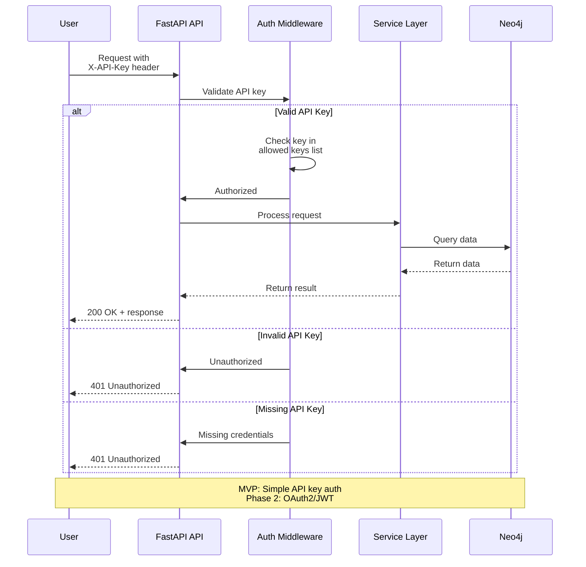

# Backend Architecture

## Service Architecture

RAG Engine uses a **hybrid serverless + containerized** approach:
- **Docker Compose for MVP**: All services run as long-lived containers (not serverless)
- **Future Kubernetes**: Horizontal scaling with multiple replicas (Phase 2)

**Service Organization:**

```plaintext
services/
├── api/                          # FastAPI REST API service
│   ├── main.py                   # FastAPI application entry point
│   ├── routers/                  # API route handlers
│   │   ├── documents.py          # Document ingestion endpoints
│   │   ├── queries.py            # RAG query endpoints
│   │   ├── graph.py              # Knowledge graph exploration
│   │   └── health.py             # Health check endpoints
│   ├── services/                 # Business logic layer
│   │   ├── document_service.py   # Document processing orchestration
│   │   ├── query_service.py      # Query execution logic
│   │   └── graph_service.py      # Graph operations
│   ├── models/                   # Pydantic request/response models
│   │   ├── requests.py           # API request schemas
│   │   ├── responses.py          # API response schemas
│   │   └── errors.py             # Error response models
│   ├── config.py                 # Configuration loading
│   ├── dependencies.py           # FastAPI dependency injection
│   ├── middleware.py             # Logging, CORS, error handling
│   └── Dockerfile                # API service container

├── lightrag/                     # LightRAG integration service
│   ├── service.py                # LightRAG wrapper with async interface
│   ├── config.py                 # LightRAG configuration
│   ├── storage_adapters.py       # Neo4j storage integration
│   └── Dockerfile                # LightRAG service container (if separate)

├── rag-anything/                 # RAG-Anything processing service
│   ├── service.py                # Document parsing orchestration
│   ├── parsers/                  # Parser implementations
│   │   ├── mineru_parser.py      # MinerU integration
│   │   └── docling_parser.py     # Docling integration (future)
│   ├── processors/               # Content processors
│   │   ├── image_processor.py    # Image captioning via VLM
│   │   ├── table_processor.py    # Table extraction/description
│   │   └── equation_processor.py # LaTeX equation parsing
│   └── Dockerfile                # RAG-Anything service container
```

---

## Controller/Route Organization Template

```python
# services/api/routers/documents.py

from fastapi import APIRouter, UploadFile, File, Depends, BackgroundTasks
from typing import Optional, Dict, Any
import structlog

from ..models.requests import IngestDocumentRequest
from ..models.responses import DocumentResponse, ApiError
from ..services.document_service import DocumentService
from ..dependencies import get_document_service

logger = structlog.get_logger()

router = APIRouter(
    prefix="/documents",
    tags=["documents"],
    responses={
        500: {"model": ApiError, "description": "Internal Server Error"}
    }
)

@router.post(
    "/ingest",
    response_model=DocumentResponse,
    status_code=202,
    summary="Ingest a new document",
    description="Upload and process a document for RAG indexing"
)
async def ingest_document(
    file: UploadFile = File(...),
    metadata: Optional[Dict[str, Any]] = None,
    doc_id: Optional[str] = None,
    parse_method: str = "auto",
    background_tasks: BackgroundTasks = BackgroundTasks(),
    service: DocumentService = Depends(get_document_service)
) -> DocumentResponse:
    """
    Ingest a document asynchronously.

    Args:
        file: Uploaded file (PDF, Office, image, etc.)
        metadata: Optional custom metadata (JSON object)
        doc_id: Optional custom document ID (auto-generated if not provided)
        parse_method: Parsing strategy (auto, ocr, txt)
        service: Injected document service

    Returns:
        DocumentResponse with processing status
    """
    logger.info(
        "document_ingest_requested",
        filename=file.filename,
        content_type=file.content_type,
        doc_id=doc_id
    )

    try:
        # Initiate async processing
        result = await service.ingest_document(
            file=file,
            metadata=metadata or {},
            doc_id=doc_id,
            parse_method=parse_method
        )

        logger.info(
            "document_ingest_accepted",
            doc_id=result.doc_id,
            status=result.status
        )

        return result

    except ValueError as e:
        logger.error("invalid_request", error=str(e))
        raise HTTPException(status_code=400, detail=str(e))

    except Exception as e:
        logger.exception("document_ingest_failed", error=str(e))
        raise HTTPException(status_code=500, detail="Internal server error")
```

---

## Database Architecture

### Schema Design

Neo4j schema is managed by LightRAG and created dynamically during `initialize_storages()`. See **Database Schema** section above for complete Cypher schema.

**Key Design Decisions:**
- **Unified vector + graph storage** in single Neo4j instance (simpler than separate vector DB)
- **Entity-centric model** with relationships as first-class citizens
- **Metadata as JSON properties** for flexible custom fields without schema changes
- **Vector embeddings stored as node/relationship properties** for efficient similarity search
- **Document provenance tracked** via `source_ids` arrays and `MENTIONED_IN` relationships

---

### Data Access Layer Template

```python
# services/lightrag/storage_adapters.py

from typing import List, Dict, Any, Optional
from neo4j import AsyncGraphDatabase, AsyncDriver
import structlog

logger = structlog.get_logger()

class Neo4jAdapter:
    """
    Adapter for Neo4j database operations.
    Wraps LightRAG's Neo4j storage with additional utility methods.
    """

    def __init__(self, uri: str, username: str, password: str):
        self.driver: AsyncDriver = AsyncGraphDatabase.driver(
            uri,
            auth=(username, password),
            max_connection_pool_size=100,
            max_connection_lifetime=3600,
            connection_timeout=30.0
        )

    async def verify_connectivity(self) -> bool:
        """Verify Neo4j connection is healthy."""
        try:
            async with self.driver.session() as session:
                result = await session.run("RETURN 1 AS num")
                record = await result.single()
                return record["num"] == 1
        except Exception as e:
            logger.error("neo4j_connection_failed", error=str(e))
            return False

    async def get_document_by_id(self, doc_id: str) -> Optional[Dict[str, Any]]:
        """
        Retrieve document node by ID.

        Args:
            doc_id: Document identifier

        Returns:
            Document properties as dict, or None if not found
        """
        query = """
        MATCH (d:Document {doc_id: $doc_id})
        RETURN d
        """
        async with self.driver.session(database="neo4j") as session:
            result = await session.run(query, doc_id=doc_id)
            record = await result.single()
            if record:
                return dict(record["d"])
            return None

    async def get_entities_by_type(
        self,
        entity_type: Optional[str] = None,
        limit: int = 100,
        offset: int = 0
    ) -> List[Dict[str, Any]]:
        """
        Retrieve entities, optionally filtered by type.

        Args:
            entity_type: Filter by entity type (optional)
            limit: Maximum number of results
            offset: Pagination offset

        Returns:
            List of entity property dicts
        """
        if entity_type:
            query = """
            MATCH (e:Entity {entity_type: $entity_type})
            RETURN e
            ORDER BY e.created_at DESC
            SKIP $offset
            LIMIT $limit
            """
            params = {"entity_type": entity_type, "offset": offset, "limit": limit}
        else:
            query = """
            MATCH (e:Entity)
            RETURN e
            ORDER BY e.created_at DESC
            SKIP $offset
            LIMIT $limit
            """
            params = {"offset": offset, "limit": limit}

        async with self.driver.session(database="neo4j") as session:
            result = await session.run(query, **params)
            records = await result.values()
            return [dict(record[0]) for record in records]

    async def close(self):
        """Close database connection."""
        await self.driver.close()
```

---

## Authentication and Authorization

### Auth Flow



---

### Middleware/Guards

```python
# services/api/middleware.py

from fastapi import Request, HTTPException, status
from fastapi.security import HTTPBearer, HTTPAuthorizationCredentials
from starlette.middleware.base import BaseHTTPMiddleware
import structlog

logger = structlog.get_logger()

class APIKeyMiddleware(BaseHTTPMiddleware):
    """
    Middleware for API key authentication (MVP).

    Phase 2 will upgrade to OAuth2/JWT for advanced auth.
    """

    def __init__(self, app, api_keys: set[str]):
        super().__init__(app)
        self.api_keys = api_keys
        self.public_paths = {"/health", "/docs", "/openapi.json", "/redoc"}

    async def dispatch(self, request: Request, call_next):
        # Allow public endpoints without auth
        if request.url.path in self.public_paths:
            return await call_next(request)

        # Extract API key from header
        api_key = request.headers.get("X-API-Key")

        if not api_key:
            logger.warning(
                "missing_api_key",
                path=request.url.path,
                client=request.client.host
            )
            raise HTTPException(
                status_code=status.HTTP_401_UNAUTHORIZED,
                detail="Missing API key. Provide X-API-Key header."
            )

        if api_key not in self.api_keys:
            logger.warning(
                "invalid_api_key",
                path=request.url.path,
                client=request.client.host
            )
            raise HTTPException(
                status_code=status.HTTP_401_UNAUTHORIZED,
                detail="Invalid API key."
            )

        # API key valid, proceed
        logger.info(
            "request_authorized",
            path=request.url.path,
            method=request.method
        )

        response = await call_next(request)
        return response


# Usage in main.py
from fastapi import FastAPI
from .middleware import APIKeyMiddleware
from .config import get_settings

app = FastAPI(title="RAG Engine API")

settings = get_settings()
if settings.enable_auth:
    app.add_middleware(
        APIKeyMiddleware,
        api_keys=set(settings.api_keys.split(","))
    )
```

**Phase 2 Auth Enhancements:**
- OAuth2 with JWT tokens for stateless auth
- Role-based access control (RBAC) for multi-user environments
- Per-document access control (who can query which documents)
- SSO integration (SAML, OIDC) for enterprise deployments

---
