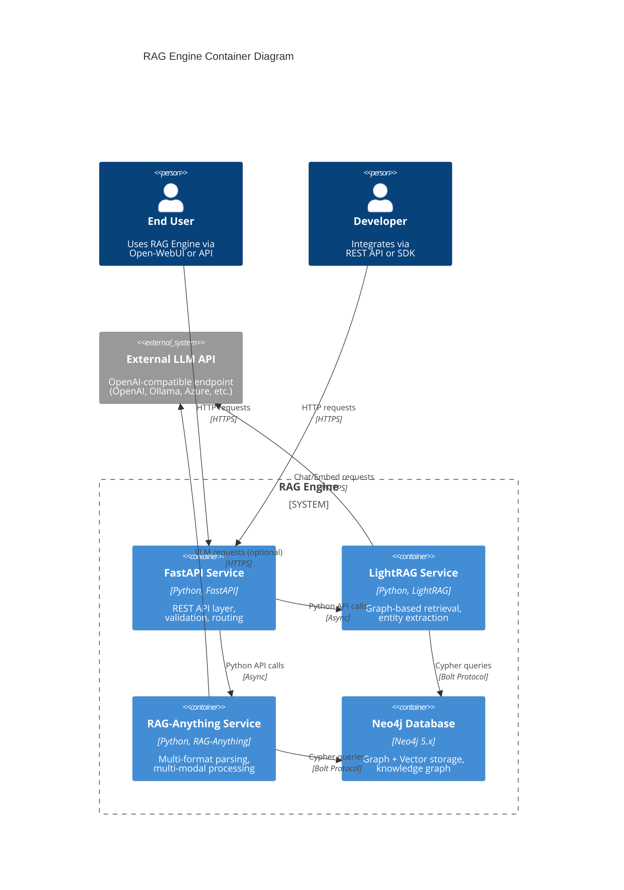

# Components

## FastAPI REST API Service

**Responsibility:** Unified entry point for all RAG Engine operations, handling HTTP requests, authentication, validation, and routing to LightRAG/RAG-Anything services. Provides OpenAPI documentation and serves multiple client types.

**Key Interfaces:**
- `POST /documents/ingest` - Document ingestion with multipart file upload
- `POST /query` - RAG query with mode selection and metadata filtering
- `GET /graph/*` - Knowledge graph exploration endpoints
- `GET /health` - Health check for all dependent services

**Dependencies:** LightRAG Service, RAG-Anything Service, Neo4j (via services)

**Technology Stack:**
- FastAPI 0.115+ with Pydantic V2 for request/response validation
- Uvicorn ASGI server for async request handling
- structlog for structured JSON logging
- python-dotenv for environment configuration
- httpx for async inter-service communication (if services are split)

---

## LightRAG Service

**Responsibility:** Graph-based retrieval engine managing entity extraction, knowledge graph construction, and multi-mode query processing (local, global, hybrid, naive, mix). Handles embedding generation and reranking.

**Key Interfaces:**
- `async def insert(content, metadata, doc_id)` - Ingest documents into knowledge graph
- `async def query(query, mode, top_k, metadata_filters)` - Execute RAG query with specified mode
- `async def delete_by_doc_id(doc_id)` - Remove document and orphaned entities/relationships
- `async def get_entities(filters)` - Retrieve entities from graph
- `async def get_relationships(entity_name)` - Get entity relationships

**Dependencies:** Neo4j (graph + vector storage), OpenAI-compatible LLM endpoint (external), RAG-Anything (for multi-modal content)

**Technology Stack:**
- LightRAG Python library (latest from HKUDS/LightRAG)
- Neo4j Python Driver for graph operations
- sentence-transformers for local embeddings (MVP)
- Reranking models (Jina/MS Marco) for result optimization

---

## RAG-Anything Service

**Responsibility:** Multi-format document processing with support for PDF, Office documents, images, tables, and equations. Extracts text, visual, and structured content for LightRAG ingestion.

**Key Interfaces:**
- `async def process_document(file_path, parse_method, metadata)` - Parse document and return content list
- `async def extract_images(file_path)` - Extract and caption images via VLM
- `async def extract_tables(file_path)` - Extract and describe tabular data
- `async def extract_equations(file_path)` - Parse LaTeX equations
- `def check_parser_installation()` - Verify MinerU/dependencies installed

**Dependencies:** MinerU parser, OpenAI-compatible VLM endpoint (external, optional for image captioning), Neo4j (for storing multi-modal entities)

**Technology Stack:**
- RAG-Anything Python library (latest from HKUDS/RAG-Anything)
- MinerU 2.0+ for document parsing with OCR
- PIL/Pillow for image format conversion
- ReportLab for text-to-PDF conversion (optional formats)
- LibreOffice for Office document conversion (external dependency)

---

## Neo4j Database

**Responsibility:** Unified graph and vector storage for knowledge graph entities, relationships, and embeddings. Provides Cypher query interface for complex graph traversals and vector similarity search.

**Key Interfaces:**
- Cypher query language for graph operations
- Vector index for embedding similarity search
- Bolt protocol (port 7687) for driver connections
- HTTP interface (port 7474) for Neo4j Browser visualization

**Dependencies:** Local volumes for data persistence

**Technology Stack:**
- Neo4j Community Edition 5.x (Phase 1)
- Neo4j Enterprise (optional for clustering, advanced security)
- Vector index plugin for embedding search
- APOC procedures for graph algorithms (optional)

**Configuration Notes:**
- **Heap Memory**: 4GB minimum (8GB recommended) - set via `NEO4J_dbms_memory_heap_max__size` in docker-compose
- **Page Cache**: 2GB minimum (4GB recommended) - set via `NEO4J_dbms_memory_pagecache_size`
- **Connection Pooling**: max_connection_pool_size=100 (default) in Python driver
- **Vector Dimensions**: Must match embedding model (384 for all-MiniLM-L6-v2, 3072 for text-embedding-3-large)

---

## Component Diagrams

---
