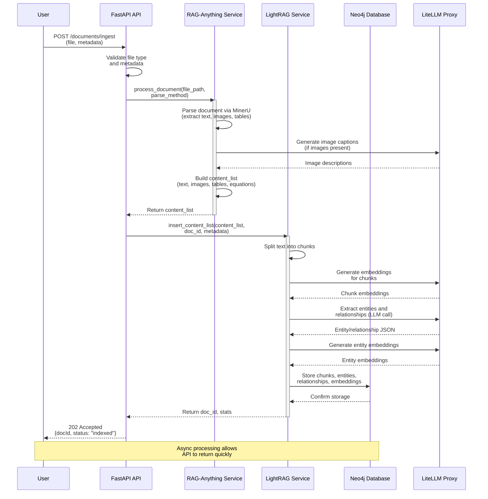
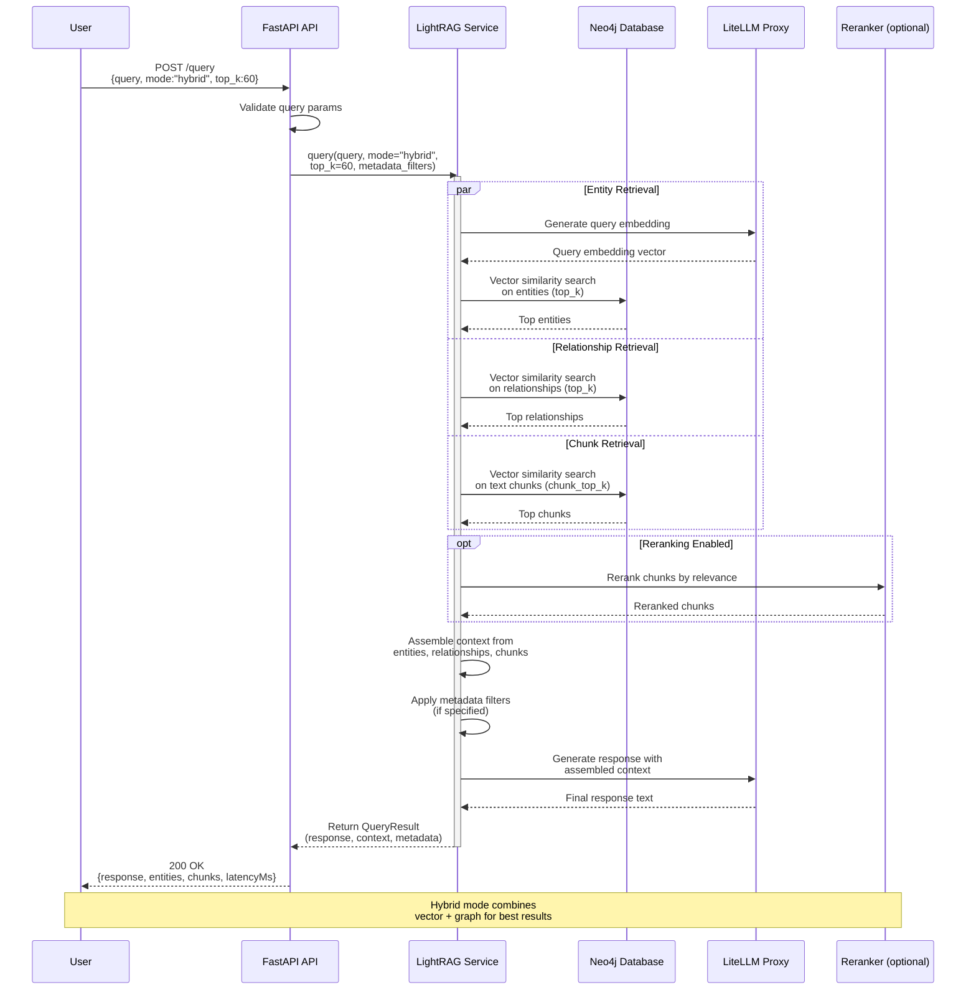
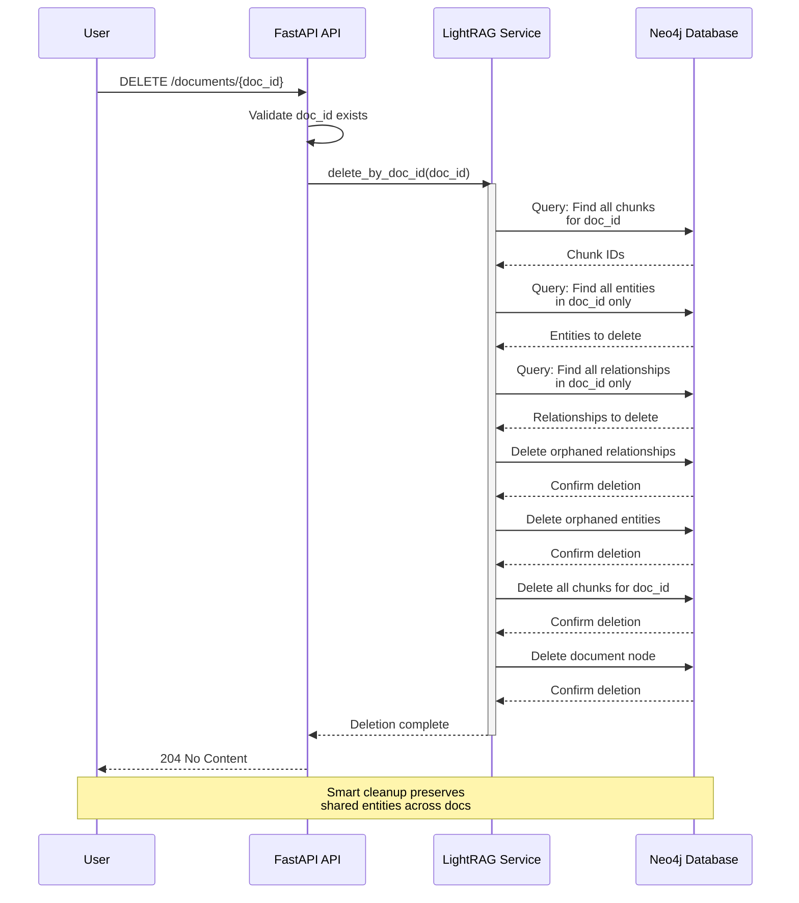

# Core Workflows

## Document Ingestion Workflow

```mermaid
sequenceDiagram
    participant User
    participant API as FastAPI API
    participant RAG as RAG-Anything Service
    participant LR as LightRAG Service
    participant Neo4j as Neo4j Database
    participant LLM as LiteLLM Proxy

    User->>API: POST /documents/ingest<br/>(file, metadata)
    API->>API: Validate file type<br/>and metadata
    API->>RAG: process_document(file_path,<br/>parse_method)
    activate RAG
    RAG->>RAG: Parse document via MinerU<br/>(extract text, images, tables)
    RAG->>LLM: Generate image captions<br/>(if images present)
    LLM-->>RAG: Image descriptions
    RAG->>RAG: Build content_list<br/>(text, images, tables, equations)
    RAG-->>API: Return content_list
    deactivate RAG

    API->>LR: insert_content_list(content_list,<br/>doc_id, metadata)
    activate LR
    LR->>LR: Split text into chunks
    LR->>LLM: Generate embeddings<br/>for chunks
    LLM-->>LR: Chunk embeddings
    LR->>LLM: Extract entities and<br/>relationships (LLM call)
    LLM-->>LR: Entity/relationship JSON
    LR->>LLM: Generate entity embeddings
    LLM-->>LR: Entity embeddings
    LR->>Neo4j: Store chunks, entities,<br/>relationships, embeddings
    Neo4j-->>LR: Confirm storage
    LR-->>API: Return doc_id, stats
    deactivate LR

    API-->>User: 202 Accepted<br/>{docId, status: "indexed"}

    Note over User,Neo4j: Async processing allows<br/>API to return quickly
```

---

## RAG Query Workflow (Hybrid Mode)

```mermaid
sequenceDiagram
    participant User
    participant API as FastAPI API
    participant LR as LightRAG Service
    participant Neo4j as Neo4j Database
    participant LLM as LiteLLM Proxy
    participant Rerank as Reranker (optional)

    User->>API: POST /query<br/>{query, mode:"hybrid", top_k:60}
    API->>API: Validate query params
    API->>LR: query(query, mode="hybrid",<br/>top_k=60, metadata_filters)
    activate LR

    par Entity Retrieval
        LR->>LLM: Generate query embedding
        LLM-->>LR: Query embedding vector
        LR->>Neo4j: Vector similarity search<br/>on entities (top_k)
        Neo4j-->>LR: Top entities
    and Relationship Retrieval
        LR->>Neo4j: Vector similarity search<br/>on relationships (top_k)
        Neo4j-->>LR: Top relationships
    and Chunk Retrieval
        LR->>Neo4j: Vector similarity search<br/>on text chunks (chunk_top_k)
        Neo4j-->>LR: Top chunks
    end

    opt Reranking Enabled
        LR->>Rerank: Rerank chunks by relevance
        Rerank-->>LR: Reranked chunks
    end

    LR->>LR: Assemble context from<br/>entities, relationships, chunks
    LR->>LR: Apply metadata filters<br/>(if specified)
    LR->>LLM: Generate response with<br/>assembled context
    LLM-->>LR: Final response text
    LR-->>API: Return QueryResult<br/>(response, context, metadata)
    deactivate LR

    API-->>User: 200 OK<br/>{response, entities, chunks, latencyMs}

    Note over User,Rerank: Hybrid mode combines<br/>vector + graph for best results
```

---

## Entity Deletion Workflow

```mermaid
sequenceDiagram
    participant User
    participant API as FastAPI API
    participant LR as LightRAG Service
    participant Neo4j as Neo4j Database

    User->>API: DELETE /documents/{doc_id}
    API->>API: Validate doc_id exists
    API->>LR: delete_by_doc_id(doc_id)
    activate LR

    LR->>Neo4j: Query: Find all chunks<br/>for doc_id
    Neo4j-->>LR: Chunk IDs
    LR->>Neo4j: Query: Find all entities<br/>in doc_id only
    Neo4j-->>LR: Entities to delete
    LR->>Neo4j: Query: Find all relationships<br/>in doc_id only
    Neo4j-->>LR: Relationships to delete

    LR->>Neo4j: Delete orphaned relationships
    Neo4j-->>LR: Confirm deletion
    LR->>Neo4j: Delete orphaned entities
    Neo4j-->>LR: Confirm deletion
    LR->>Neo4j: Delete all chunks for doc_id
    Neo4j-->>LR: Confirm deletion
    LR->>Neo4j: Delete document node
    Neo4j-->>LR: Confirm deletion

    LR-->>API: Deletion complete
    deactivate LR
    API-->>User: 204 No Content

    Note over User,Neo4j: Smart cleanup preserves<br/>shared entities across docs
```

---
