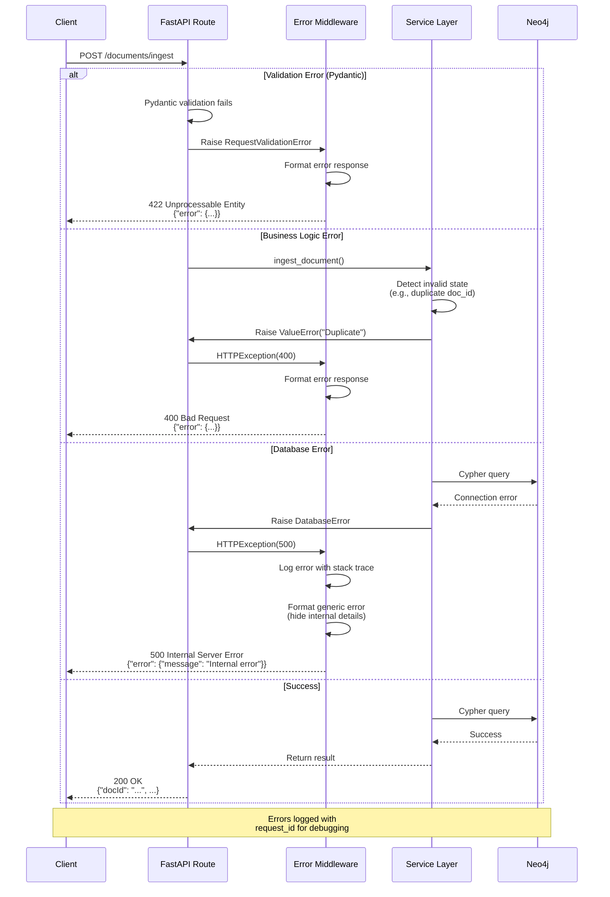

# Error Handling Strategy

## Error Flow



---

## Error Response Format

```typescript
// Defined in services/api/models/errors.py

interface ApiError {
  error: {
    code: string;              // Machine-readable error code (e.g., "INVALID_FILE_TYPE")
    message: string;           // Human-readable error message
    details?: Record<string, any>;  // Optional error details (validation errors, etc.)
    timestamp: string;         // ISO 8601 timestamp
    requestId: string;         // Unique request ID for tracing
  };
}
```

**Example Error Responses:**

```json
// Validation Error (422)
{
  "error": {
    "code": "VALIDATION_ERROR",
    "message": "Invalid request parameters",
    "details": {
      "field": "parse_method",
      "error": "Must be one of: auto, ocr, txt"
    },
    "timestamp": "2025-10-15T12:34:56.789Z",
    "requestId": "req_abc123xyz"
  }
}

// Business Logic Error (400)
{
  "error": {
    "code": "DUPLICATE_DOCUMENT",
    "message": "Document with ID 'doc-123' already exists",
    "details": {
      "doc_id": "doc-123",
      "existing_status": "indexed"
    },
    "timestamp": "2025-10-15T12:35:00.123Z",
    "requestId": "req_def456uvw"
  }
}

// Internal Server Error (500)
{
  "error": {
    "code": "INTERNAL_ERROR",
    "message": "An internal error occurred. Please contact support with request ID.",
    "timestamp": "2025-10-15T12:36:00.456Z",
    "requestId": "req_ghi789rst"
  }
}
```

---

## Backend Error Handling

```python
# services/api/middleware.py

from fastapi import Request, HTTPException, status
from fastapi.responses import JSONResponse
from fastapi.exceptions import RequestValidationError
import structlog
import uuid
from datetime import datetime, timezone

logger = structlog.get_logger()

class ErrorHandlingMiddleware:
    """Global error handler for all API errors."""

    def __init__(self, app):
        self.app = app

    async def __call__(self, scope, receive, send):
        if scope["type"] != "http":
            await self.app(scope, receive, send)
            return

        # Generate request ID
        request_id = str(uuid.uuid4())
        scope["request_id"] = request_id

        try:
            await self.app(scope, receive, send)

        except RequestValidationError as exc:
            # Pydantic validation errors (422)
            logger.warning(
                "validation_error",
                request_id=request_id,
                errors=exc.errors()
            )

            response = JSONResponse(
                status_code=status.HTTP_422_UNPROCESSABLE_ENTITY,
                content={
                    "error": {
                        "code": "VALIDATION_ERROR",
                        "message": "Invalid request parameters",
                        "details": exc.errors(),
                        "timestamp": datetime.now(timezone.utc).isoformat(),
                        "requestId": request_id
                    }
                }
            )
            await response(scope, receive, send)

        except HTTPException as exc:
            # Explicit HTTP exceptions from routes
            logger.warning(
                "http_exception",
                request_id=request_id,
                status_code=exc.status_code,
                detail=exc.detail
            )

            response = JSONResponse(
                status_code=exc.status_code,
                content={
                    "error": {
                        "code": exc.detail.get("code", "ERROR"),
                        "message": exc.detail.get("message", str(exc.detail)),
                        "details": exc.detail.get("details"),
                        "timestamp": datetime.now(timezone.utc).isoformat(),
                        "requestId": request_id
                    }
                }
            )
            await response(scope, receive, send)

        except Exception as exc:
            # Unhandled exceptions (500)
            logger.exception(
                "unhandled_exception",
                request_id=request_id,
                exception=str(exc)
            )

            # Hide internal error details from client
            response = JSONResponse(
                status_code=status.HTTP_500_INTERNAL_SERVER_ERROR,
                content={
                    "error": {
                        "code": "INTERNAL_ERROR",
                        "message": "An internal error occurred. Please contact support with request ID.",
                        "timestamp": datetime.now(timezone.utc).isoformat(),
                        "requestId": request_id
                    }
                }
            )
            await response(scope, receive, send)


# Usage in main.py
from fastapi import FastAPI
from .middleware import ErrorHandlingMiddleware

app = FastAPI()
app.add_middleware(ErrorHandlingMiddleware)
```

---

## Custom Exception Classes

```python
# services/api/models/errors.py

class RagEngineException(Exception):
    """Base exception for RAG Engine errors."""

    def __init__(self, code: str, message: str, details: dict = None):
        self.code = code
        self.message = message
        self.details = details or {}
        super().__init__(message)


class DocumentAlreadyExistsError(RagEngineException):
    """Raised when attempting to ingest a document with existing doc_id."""

    def __init__(self, doc_id: str):
        super().__init__(
            code="DUPLICATE_DOCUMENT",
            message=f"Document with ID '{doc_id}' already exists",
            details={"doc_id": doc_id}
        )


class DocumentNotFoundError(RagEngineException):
    """Raised when document ID not found in database."""

    def __init__(self, doc_id: str):
        super().__init__(
            code="DOCUMENT_NOT_FOUND",
            message=f"Document '{doc_id}' not found",
            details={"doc_id": doc_id}
        )


class UnsupportedFileTypeError(RagEngineException):
    """Raised when file type is not supported by parser."""

    def __init__(self, file_type: str, supported_types: list[str]):
        super().__init__(
            code="UNSUPPORTED_FILE_TYPE",
            message=f"File type '{file_type}' is not supported",
            details={
                "file_type": file_type,
                "supported_types": supported_types
            }
        )


class Neo4jConnectionError(RagEngineException):
    """Raised when Neo4j database connection fails."""

    def __init__(self, uri: str):
        super().__init__(
            code="DATABASE_CONNECTION_ERROR",
            message="Failed to connect to Neo4j database",
            details={"uri": uri}
        )


class LLMAPIError(RagEngineException):
    """Raised when LLM API call fails."""

    def __init__(self, provider: str, error: str):
        super().__init__(
            code="LLM_API_ERROR",
            message=f"LLM API error from {provider}",
            details={"provider": provider, "error": error}
        )
```

**Usage in Routes:**

```python
from fastapi import HTTPException, status
from ..models.errors import DocumentAlreadyExistsError, UnsupportedFileTypeError

@router.post("/documents/ingest")
async def ingest_document(...):
    try:
        result = await service.ingest_document(...)
        return result

    except DocumentAlreadyExistsError as e:
        raise HTTPException(
            status_code=status.HTTP_400_BAD_REQUEST,
            detail={
                "code": e.code,
                "message": e.message,
                "details": e.details
            }
        )

    except UnsupportedFileTypeError as e:
        raise HTTPException(
            status_code=status.HTTP_400_BAD_REQUEST,
            detail={
                "code": e.code,
                "message": e.message,
                "details": e.details
            }
        )
```

---
