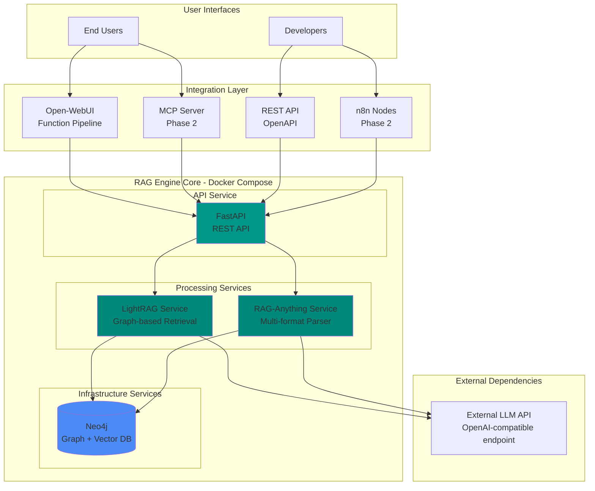

# High Level Architecture

## Technical Summary

RAG Engine implements a **microservices-based architecture** deployed via **Docker Compose**, combining best-in-class open-source RAG technologies (LightRAG, RAG-Anything) with a **FastAPI REST API layer** for universal access. The system uses **Neo4j** as both vector and graph storage to enable sophisticated entity-relationship retrieval, connecting to external **OpenAI-compatible LLM endpoints** (OpenAI, Ollama, Azure, or external LiteLLM proxy) for flexible LLM access. Documents are processed through **RAG-Anything's multi-format parser**, indexed into LightRAG's **knowledge graph**, and served through multiple interfaces: **Open-WebUI function pipelines**, **MCP server protocol**, **REST API**, and future **n8n custom nodes** and **Pydantic SDK**. Deployment targets **Linux/macOS/Windows** via Docker containers with optional **GPU acceleration** for document processing. This architecture achieves "ultimate RAG" quality through graph-augmented retrieval while maintaining **single-command deployment simplicity** for the target user base of self-hosters and developers.

## Platform and Infrastructure Choice

**Platform:** Docker-based Local Deployment (Primary) with Cloud-agnostic Design

**Deployment Philosophy**:
- **Primary**: Docker Compose for local/self-hosted deployment (MVP target)
- **Secondary**: Kubernetes-ready architecture for Phase 2 scale-out
- **No vendor lock-in**: All components are open-source and portable

**Key Services:**
- **Containerization**: Docker 24.0+ and Docker Compose V2
- **Graph & Vector Database**: Neo4j 5.x (Community Edition for MVP, Enterprise optional)
- **Document Processing**: RAG-Anything with MinerU parser
- **RAG Framework**: LightRAG with graph-based retrieval
- **LLM Integration**: External OpenAI-compatible API endpoints (configurable)
- **Storage**: Local volumes for persistence, with backup strategy via Neo4j dumps

**Deployment Host and Regions:**
- **Target**: Self-hosted on user hardware (home servers, workstations, VPS)
- **Minimum**: 8GB RAM, 4 CPU cores, 50GB storage
- **Recommended**: 16GB RAM, 8 CPU cores, 100GB+ storage
- **Networks**: Internal Docker network for service communication
- **External Access**: Optional reverse proxy (Nginx/Traefik) for remote access

**Rationale**:
- Privacy-first for sensitive knowledge bases
- Zero operational costs (excluding optional LLM API usage)
- Aligns with Open-WebUI community's self-hosting culture
- Simple deployment reduces barrier to adoption
- Cloud-agnostic design enables future managed offerings

## Repository Structure

**Structure:** Monorepo with service-oriented packages

**Monorepo Tool:** None required for MVP (simple Python project structure with shared modules)

**Rationale**: A lightweight monorepo without complex tooling fits the Python ecosystem better than JavaScript-style monorepo tools. All services share common Python dependencies via pip/poetry, and inter-service communication is via REST APIs and shared data models.

**Package Organization:**

```
rag-engine/
├── services/           # Microservice containers
│   ├── api/           # FastAPI REST API
│   ├── lightrag/      # LightRAG integration service
│   ├── rag-anything/  # Document processing service
├── shared/            # Shared Python modules
│   ├── models/        # Pydantic data models
│   ├── config/        # Configuration schemas
│   └── utils/         # Shared utilities
├── integrations/      # Pre-built integrations
│   ├── openwebui/     # Open-WebUI function pipeline
│   ├── mcp/           # MCP server (Phase 2)
│   └── n8n/           # n8n nodes (Phase 2)
└── infrastructure/    # Docker and deployment configs
```

## High Level Architecture Diagram



## Architectural Patterns

- **Microservices Architecture:** Containerized services with clear boundaries (API, LightRAG, RAG-Anything, Neo4j) - _Rationale:_ Enables independent scaling, isolated failure domains, and technology flexibility while maintaining operational simplicity via Docker Compose

- **Repository Pattern:** Abstract data access to Neo4j through LightRAG's storage layer - _Rationale:_ Enables testing with mock storage and potential future migration to alternative graph databases

- **API Gateway Pattern:** FastAPI service as single entry point routing to LightRAG and RAG-Anything - _Rationale:_ Centralized authentication, request validation, and consistent error handling across all clients

- **Service Layer Pattern:** Business logic encapsulated in service classes separate from API routes - _Rationale:_ Promotes reusability and testability of core RAG operations

- **Adapter Pattern:** Unified interface abstracting LightRAG and RAG-Anything implementation details - _Rationale:_ Allows swapping or upgrading underlying frameworks without breaking API contracts

- **Event-Driven Processing:** Async document ingestion with status tracking - _Rationale:_ Non-blocking API responses for long-running document processing operations

- **Configuration as Code:** Environment-based config with validation via Pydantic - _Rationale:_ Type-safe configuration prevents runtime errors and provides clear documentation

---
