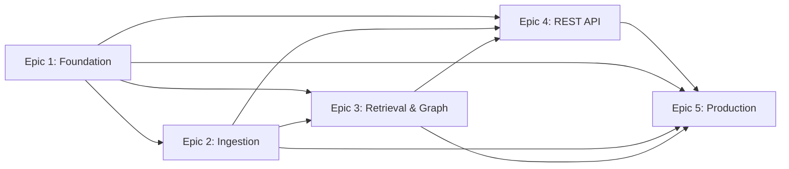

# RAG Engine Epic Index

**Project:** RAG Engine
**Total Epics:** 5
**Total Stories:** 37 (includes Story 0.1 technical spike)
**Created:** 2025-10-15
**Updated:** 2025-10-16
**Status:** Epic 1 Complete ✅ | Story 0.1 Recommended ⚠️ | Epic 2 Ready for Dev 🔵

---

## Epic Overview

| Epic | Title | Stories | Story Points | Duration (Est.) | Status |
|------|-------|---------|--------------|-----------------|--------|
| [Story 0.1](0.1.rag-anything-spike.md) | RAG-Anything Technical Validation (Pre-Epic 2) | 1 | 3 | 2 days | ⚠️ **Recommended** |
| [Epic 1](epic-1-foundation.md) | Foundation & Core Infrastructure | 6 | 21 | 1.5-2 weeks | ✅ **Done** |
| [Epic 2](epic-2-ingestion.md) | Multi-Format Document Ingestion Pipeline | 7 | 28 | 2-3 weeks | 🔵 Ready for Dev |
| [Epic 3](epic-3-retrieval-graph-viz.md) | Graph-Based Retrieval & Knowledge Graph Construction | 11 | 44 | 3-4 weeks | 🔵 Draft |
| [Epic 4](epic-4-rest-api.md) | REST API & Integration Layer | 5 | 20 | 1.5-2 weeks | 🔵 Draft |
| [Epic 5](epic-5-production-readiness.md) | Open-WebUI Integration & Production Readiness | 7 | 30 | 2-3 weeks | 🔵 Draft |
| **TOTAL** | | **37** | **146** | **11-14 weeks + 2 days** | |

---

## Epic Sequence and Dependencies

**Critical Path:** Epic 1 → **Story 0.1 (Spike)** → Epic 2 → Epic 3 → Epic 4 → Epic 5

---

## Story 0.1: RAG-Anything Technical Validation Spike ⚠️

**Status:** ⚠️ **RECOMMENDED** (Pre-Epic 2)
**Goal:** Validate RAG-Anything library compatibility with 6 required document formats before committing to Epic 2 implementation

**Key Deliverables:**
- ⚠️ Format support validation (6 document formats: PDF, TXT, MD, DOCX, PPTX, CSV)
- ⚠️ Performance benchmarking
- ⚠️ Spike report with go/no-go recommendation
- ⚠️ Fallback parser identification (if needed)

**Story:** (1 spike, 2 days)
1. ⚠️ [0.1] RAG-Anything Technical Validation Spike - Validate all 6 document formats, benchmark performance, document limitations

**Story Points:** 3 | **Duration:** 2 days | **Type:** Technical Spike

**Why This Spike?**
- RAG-Anything is version 0.x (pre-release/beta)
- MinerU 2.0+ recently released with potential breaking changes
- Epic 2 assumes RAG-Anything works for all formats - need validation before 3-week investment
- Risk mitigation: If RAG-Anything fails, spike identifies fallback parsers (pypdf, python-docx, python-pptx, pandas)

**Document Format Rationale:**
- **PDF:** Primary format for technical docs, reports, research papers
- **DOCX:** Microsoft Word documents (standard business format)
- **PPTX:** Microsoft PowerPoint presentations (slides, training materials)
- **TXT:** Plain text files (logs, code, simple docs)
- **MD:** Markdown files (documentation, README files)
- **CSV:** Structured data tables (spreadsheets, data exports)

**Recommendation:** Complete Story 0.1 before starting Epic 2 to de-risk the ingestion pipeline.

---

## Epic 1: Foundation & Core Infrastructure ✅

**Status:** ✅ **COMPLETE** (2025-10-16)
**Goal:** Establish Docker-based project foundation with Neo4j integration and health checks

**Key Deliverables:**
- ✅ Docker Compose orchestration
- ✅ Neo4j with vector support
- ✅ FastAPI API service
- ✅ Health monitoring
- ✅ Structured logging
- ✅ Deployment documentation

**Stories:** (All Complete)
1. ✅ [1.1] Initialize Repository Structure and Docker Compose Configuration - QA: 95/100
2. ✅ [1.2] Deploy Neo4j with Vector Support and Verify Connectivity
3. ✅ [1.3] Create API Service with FastAPI and Health Check Endpoint
4. ✅ [1.4] Implement Service Health Monitoring and Neo4j Connection Verification - QA: 95/100
5. ✅ [1.5] Configure Structured Logging and Docker Compose Logging - QA: 85/100
6. ✅ [1.6] Create End-to-End Deployment Test and Documentation

**Story Points:** 21 | **Duration:** 1.5-2 weeks | **Actual:** Completed on schedule
**QA Average:** 91.7/100 (Excellent)

---

## Epic 2: Multi-Format Document Ingestion Pipeline

**Status:** 🔵 **READY FOR DEVELOPMENT** (with Story 0.1 spike recommended first)
**Goal:** Integrate RAG-Anything for multi-format parsing with metadata support

**Key Deliverables:**
- RAG-Anything integration
- Metadata schema configuration
- Document ingestion API
- Batch ingestion with progress tracking
- Entity type configuration
- Document management API
- Schema migration support

**Stories:**
1. [2.1] Integrate RAG-Anything Library and Create Document Parsing Service
2. [2.2] Implement Metadata Schema Definition and Validation
3. [2.3] Create Document Ingestion API Endpoint with Metadata Support
4. [2.4] Implement Batch Document Ingestion and Progress Tracking
5. [2.5] Create Entity Type Configuration and Pre-Ingestion Setup
6. [2.6] Implement Document Management API (List, Retrieve, Delete)
7. [2.7] Implement Metadata Schema Migration and Reindexing

**Story Points:** 28 | **Duration:** 2-3 weeks

**Pre-Development Review Updates (2025-10-16):**
- ✅ Added Story 0.1 technical spike dependency
- ✅ Clarified Neo4j storage schema (Story 2.3)
- ✅ Specified Python asyncio queue mechanism (Story 2.3)
- ✅ Documented mock auth strategy for Epic 2 (real auth in Epic 4)
- ✅ Added performance testing criteria (Story 2.4)
- ✅ Added GPU acceleration documentation (Story 2.1)
- ✅ Optimized sprint plan: Stories 2.1, 2.2, 2.5 can run in parallel

**Recommended Sprint Plan:**
- **Sprint 1 (Week 1):** Stories 2.1, 2.2, 2.5 in parallel (~12 points)
- **Sprint 2 (Week 2):** Story 2.3 (depends on 2.1+2.2, ~5 points)
- **Sprint 3 (Week 3):** Stories 2.4, 2.6, 2.7 sequential (~11 points)

---

## Epic 3: Graph-Based Retrieval & Knowledge Graph Construction

**Goal:** Integrate LightRAG for entity extraction, hybrid retrieval, and graph visualization

**Key Deliverables:**
- LightRAG integration with Neo4j
- Entity extraction with custom types
- Relationship mapping
- Hybrid retrieval pipeline (vector + graph + BM25)
- Metadata-based pre-filtering
- Reranking pipeline
- LightRAG Server UI
- Neo4j Browser guide
- Graph exploration workflows
- Entity type evolution

**Stories:**
1. [3.1] Integrate LightRAG Core Library and Initialize Graph Storage
2. [3.2] Implement Entity Extraction with Custom Entity Types
3. [3.3] Implement Relationship Mapping and Graph Construction
4. [3.4] Implement Hybrid Retrieval Pipeline (Vector + Graph + BM25)
5. [3.5] Implement Metadata-Based Pre-Filtering for Retrieval
6. [3.6] Integrate Reranking Pipeline for Result Refinement
7. [3.7] Deploy LightRAG Server as Docker Service
8. [3.8] Configure Neo4j Browser Access and Documentation
9. [3.9] Document Graph Exploration Workflows
10. [3.10] Implement Graph Metadata and Entity Type Filtering
11. [3.11] Implement Entity Type Schema Evolution and Re-Extraction

**Story Points:** 44 | **Duration:** 3-4 weeks | **LARGEST EPIC**

---

## Epic 4: REST API & Integration Layer

**Goal:** Develop unified REST API with OpenAPI documentation

**Key Deliverables:**
- Unified API Gateway
- API authentication and rate limiting
- OpenAPI specification and interactive docs
- Request validation and error handling
- Client examples (Python, JavaScript, cURL)
- Integration guide

**Stories:**
1. [4.1] Consolidate API Endpoints and Create Unified API Gateway
2. [4.2] Implement API Authentication and Rate Limiting
3. [4.3] Create Comprehensive OpenAPI Specification and Interactive Docs
4. [4.4] Implement Request Validation and Error Handling
5. [4.5] Create API Client Examples and Integration Guides

**Story Points:** 20 | **Duration:** 1.5-2 weeks

---

## Epic 5: Open-WebUI Integration & Production Readiness

**Goal:** Create Open-WebUI integration and production deployment readiness

**Key Deliverables:**
- Open-WebUI Function Pipeline
- Production error handling and retry logic
- Monitoring endpoints and metrics
- Production deployment documentation
- End-to-end MVP validation
- Performance benchmarks (NFR1, NFR9, NFR2)
- Quick start guide
- Sample dataset

**Stories:**
1. [5.1] Develop Open-WebUI Function Pipeline
2. [5.2] Implement Production-Grade Error Handling and Retry Logic
3. [5.3] Implement Monitoring Endpoints and Operational Metrics
4. [5.4] Create Production Deployment Documentation
5. [5.5] Conduct End-to-End MVP Validation and Performance Testing
6. [5.6] Create User Onboarding Documentation and Quick Start Guide
7. [5.7] BEIR SciFact Retrieval Quality Benchmark (NFR2 validation)

**Story Points:** 30 | **Duration:** 2-3 weeks

---

## MVP Success Criteria

### Performance Targets (from NFRs)
- **NFR1:** P95 query latency <2s on 1000-document knowledge base
- **NFR2:** MRR > 0.80 on BEIR SciFact (vs. 0.65-0.70 baseline, 15+ percentage point improvement)
- **NFR3:** End-to-end deployment <30 minutes (clone → ingest 100+ docs → query)
- **NFR6:** Support 1000 documents with acceptable performance on MVP hardware
- **NFR9:** Metadata filtering >40% latency reduction on 20% subset

### Functional Completeness
- ✅ Single-command Docker deployment (`docker-compose up -d`)
- ✅ Multi-format document ingestion (PDF, Markdown, HTML, Word, code)
- ✅ Custom metadata fields and entity types
- ✅ Hybrid retrieval with graph traversal
- ✅ Graph visualization via LightRAG Server
- ✅ Open-WebUI Function Pipeline
- ✅ REST API with OpenAPI documentation
- ✅ Production deployment guide

### User Journeys Supported
1. New User Onboarding (First-Time Deployment)
2. Knowledge Base Population (Document Ingestion)
3. Query and Retrieval Optimization
4. Open-WebUI Integration
5. Troubleshooting and Knowledge Base Management

---

## Next Steps

### For Scrum Master (Bob)
1. ✅ Review epic files and create individual story files using `story-tmpl.yaml`
2. Create individual story files for Epic 2 (Stories 2.1-2.7)
3. Break down Epic 3 (largest) into manageable sprints
4. ⚠️ **PRIORITY:** Schedule Story 0.1 spike before Epic 2 development (2 days)
5. Sequence stories within epics based on dependencies

### For Development Agent
1. ✅ Epic 1 Complete (Stories 1.1-1.6)
2. ⚠️ **NEXT:** Execute Story 0.1 RAG-Anything Technical Spike (2 days)
3. Review spike report and make go/no-go decision
4. Begin Epic 2 Sprint 1: Stories 2.1, 2.2, 2.5 in parallel
5. Follow test-driven development approach
6. Use `docs/architecture.md` as technical reference
7. Track progress in debug log (`.ai/debug-log.md`)

### For Product Manager (John)
1. ✅ Epic 2 pre-development review complete (2025-10-16)
2. ✅ Story 0.1 spike created
3. Monitor Story 0.1 spike results for go/no-go decision
4. Approve Epic 2 start after spike validation
5. Review Epic 3 before development begins

### For Product Owner (Sarah)
1. ✅ PO Master Checklist validation complete (92% pass rate)
2. ✅ Epic files created
3. ✅ Epic 1 complete
4. Approve Story 0.1 spike execution
5. Monitor Epic 3 complexity during implementation
6. Validate MVP success criteria in Epic 5 Story 5.5
7. Approve production launch after all NFRs validated

---

## Project Timeline (Estimated)

**Solo Developer:** 11-14 weeks + 2 days (3-3.5 months)

- **Days 1-2:** Story 0.1 (RAG-Anything Spike) - **NEW**
- **Weeks 1-2:** Epic 1 (Foundation) - ✅ **COMPLETE**
- **Weeks 3-5:** Epic 2 (Ingestion)
- **Weeks 6-9:** Epic 3 (Retrieval & Graph) - **CRITICAL PATH**
- **Weeks 10-11:** Epic 4 (REST API)
- **Weeks 12-14:** Epic 5 (Production Readiness)

**Note:** PRD suggests 4-6 months realistic timeline accounting for learning curve, testing, and documentation.

---

## Key Risks

1. **Epic 3 Complexity** (11 stories, largest epic) - Monitor progress, consider splitting
2. **LightRAG/RAG-Anything Integration** - ✅ **MITIGATED:** Story 0.1 technical spike created
3. **Performance Targets** (NFR1, NFR2, NFR9) - Early benchmarking, optimization
4. **LLM API Costs** - Use local models (Ollama), mock endpoints in tests
5. **Timeline Realism** - 11-14 weeks optimistic, 16-24 weeks more realistic

**Risk Mitigation Update (2025-10-16):**
- ✅ Story 0.1 spike added to validate RAG-Anything before Epic 2 investment
- ✅ Epic 2 updated with Neo4j schema, queue mechanism, auth strategy clarifications
- ✅ Sprint plan optimized for parallel story execution in Epic 2

---

## Validation and Approval

✅ **PO Master Checklist:** 92% pass rate (79/82 applicable items)
✅ **Greenfield Project:** No existing codebase to modify
✅ **No Custom UI:** Service-native interfaces only
✅ **Dependencies Sequenced:** Zero reverse dependencies
✅ **User Journeys Documented:** 5 complete workflows
✅ **Integration Testing Strategy:** 4-level approach
✅ **Schema Migration:** Metadata and entity type evolution
✅ **NFR Measurement:** BEIR SciFact benchmark for retrieval quality

**Status:** ✅ **APPROVED FOR DEVELOPMENT**

---

**Created By:** Sarah (Product Owner Agent)
**Date:** 2025-10-15
**Version:** 1.0
