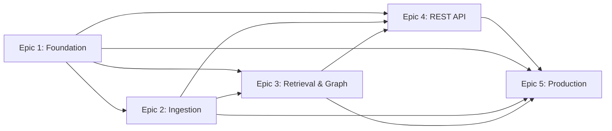

# RAG Engine Epic Index

**Project:** RAG Engine
**Total Epics:** 5
**Total Stories:** 36
**Created:** 2025-10-15
**Status:** Ready for Development

---

## Epic Overview

| Epic | Title | Stories | Story Points | Duration (Est.) | Status |
|------|-------|---------|--------------|-----------------|--------|
| [Epic 1](epic-1-foundation.md) | Foundation & Core Infrastructure | 6 | 21 | 1.5-2 weeks | Draft |
| [Epic 2](epic-2-ingestion.md) | Multi-Format Document Ingestion Pipeline | 7 | 28 | 2-3 weeks | Draft |
| [Epic 3](epic-3-retrieval-graph-viz.md) | Graph-Based Retrieval & Knowledge Graph Construction | 11 | 44 | 3-4 weeks | Draft |
| [Epic 4](epic-4-rest-api.md) | REST API & Integration Layer | 5 | 20 | 1.5-2 weeks | Draft |
| [Epic 5](epic-5-production-readiness.md) | Open-WebUI Integration & Production Readiness | 7 | 30 | 2-3 weeks | Draft |
| **TOTAL** | | **36** | **143** | **11-14 weeks** | |

---

## Epic Sequence and Dependencies

**Critical Path:** Epic 1 → Epic 2 → Epic 3 → Epic 4 → Epic 5

---

## Epic 1: Foundation & Core Infrastructure

**Goal:** Establish Docker-based project foundation with Neo4j integration and health checks

**Key Deliverables:**
- Docker Compose orchestration
- Neo4j with vector support
- FastAPI API service
- Health monitoring
- Structured logging
- Deployment documentation

**Stories:**
1. [1.1] Initialize Repository Structure and Docker Compose Configuration
2. [1.2] Deploy Neo4j with Vector Support and Verify Connectivity
3. [1.3] Create API Service with FastAPI and Health Check Endpoint
4. [1.4] Implement Service Health Monitoring and Neo4j Connection Verification
5. [1.5] Configure Structured Logging and Docker Compose Logging
6. [1.6] Create End-to-End Deployment Test and Documentation

**Story Points:** 21 | **Duration:** 1.5-2 weeks

---

## Epic 2: Multi-Format Document Ingestion Pipeline

**Goal:** Integrate RAG-Anything for multi-format parsing with metadata support

**Key Deliverables:**
- RAG-Anything integration
- Metadata schema configuration
- Document ingestion API
- Batch ingestion with progress tracking
- Entity type configuration
- Document management API
- Schema migration support

**Stories:**
1. [2.1] Integrate RAG-Anything Library and Create Document Parsing Service
2. [2.2] Implement Metadata Schema Definition and Validation
3. [2.3] Create Document Ingestion API Endpoint with Metadata Support
4. [2.4] Implement Batch Document Ingestion and Progress Tracking
5. [2.5] Create Entity Type Configuration and Pre-Ingestion Setup
6. [2.6] Implement Document Management API (List, Retrieve, Delete)
7. [2.7] Implement Metadata Schema Migration and Reindexing

**Story Points:** 28 | **Duration:** 2-3 weeks

---

## Epic 3: Graph-Based Retrieval & Knowledge Graph Construction

**Goal:** Integrate LightRAG for entity extraction, hybrid retrieval, and graph visualization

**Key Deliverables:**
- LightRAG integration with Neo4j
- Entity extraction with custom types
- Relationship mapping
- Hybrid retrieval pipeline (vector + graph + BM25)
- Metadata-based pre-filtering
- Reranking pipeline
- LightRAG Server UI
- Neo4j Browser guide
- Graph exploration workflows
- Entity type evolution

**Stories:**
1. [3.1] Integrate LightRAG Core Library and Initialize Graph Storage
2. [3.2] Implement Entity Extraction with Custom Entity Types
3. [3.3] Implement Relationship Mapping and Graph Construction
4. [3.4] Implement Hybrid Retrieval Pipeline (Vector + Graph + BM25)
5. [3.5] Implement Metadata-Based Pre-Filtering for Retrieval
6. [3.6] Integrate Reranking Pipeline for Result Refinement
7. [3.7] Deploy LightRAG Server as Docker Service
8. [3.8] Configure Neo4j Browser Access and Documentation
9. [3.9] Document Graph Exploration Workflows
10. [3.10] Implement Graph Metadata and Entity Type Filtering
11. [3.11] Implement Entity Type Schema Evolution and Re-Extraction

**Story Points:** 44 | **Duration:** 3-4 weeks | **LARGEST EPIC**

---

## Epic 4: REST API & Integration Layer

**Goal:** Develop unified REST API with OpenAPI documentation

**Key Deliverables:**
- Unified API Gateway
- API authentication and rate limiting
- OpenAPI specification and interactive docs
- Request validation and error handling
- Client examples (Python, JavaScript, cURL)
- Integration guide

**Stories:**
1. [4.1] Consolidate API Endpoints and Create Unified API Gateway
2. [4.2] Implement API Authentication and Rate Limiting
3. [4.3] Create Comprehensive OpenAPI Specification and Interactive Docs
4. [4.4] Implement Request Validation and Error Handling
5. [4.5] Create API Client Examples and Integration Guides

**Story Points:** 20 | **Duration:** 1.5-2 weeks

---

## Epic 5: Open-WebUI Integration & Production Readiness

**Goal:** Create Open-WebUI integration and production deployment readiness

**Key Deliverables:**
- Open-WebUI Function Pipeline
- Production error handling and retry logic
- Monitoring endpoints and metrics
- Production deployment documentation
- End-to-end MVP validation
- Performance benchmarks (NFR1, NFR9, NFR2)
- Quick start guide
- Sample dataset

**Stories:**
1. [5.1] Develop Open-WebUI Function Pipeline
2. [5.2] Implement Production-Grade Error Handling and Retry Logic
3. [5.3] Implement Monitoring Endpoints and Operational Metrics
4. [5.4] Create Production Deployment Documentation
5. [5.5] Conduct End-to-End MVP Validation and Performance Testing
6. [5.6] Create User Onboarding Documentation and Quick Start Guide
7. [5.7] BEIR SciFact Retrieval Quality Benchmark (NFR2 validation)

**Story Points:** 30 | **Duration:** 2-3 weeks

---

## MVP Success Criteria

### Performance Targets (from NFRs)
- **NFR1:** P95 query latency <2s on 1000-document knowledge base
- **NFR2:** MRR > 0.80 on BEIR SciFact (vs. 0.65-0.70 baseline, 15+ percentage point improvement)
- **NFR3:** End-to-end deployment <30 minutes (clone → ingest 100+ docs → query)
- **NFR6:** Support 1000 documents with acceptable performance on MVP hardware
- **NFR9:** Metadata filtering >40% latency reduction on 20% subset

### Functional Completeness
- ✅ Single-command Docker deployment (`docker-compose up -d`)
- ✅ Multi-format document ingestion (PDF, Markdown, HTML, Word, code)
- ✅ Custom metadata fields and entity types
- ✅ Hybrid retrieval with graph traversal
- ✅ Graph visualization via LightRAG Server
- ✅ Open-WebUI Function Pipeline
- ✅ REST API with OpenAPI documentation
- ✅ Production deployment guide

### User Journeys Supported
1. New User Onboarding (First-Time Deployment)
2. Knowledge Base Population (Document Ingestion)
3. Query and Retrieval Optimization
4. Open-WebUI Integration
5. Troubleshooting and Knowledge Base Management

---

## Next Steps

### For Scrum Master (Bob)
1. Review epic files and create individual story files using `story-tmpl.yaml`
2. Break down Epic 3 (largest) into manageable sprints
3. Consider Story 0.1 technical spike for LightRAG/RAG-Anything validation
4. Sequence stories within epics based on dependencies

### For Development Agent
1. Wait for story file creation by Scrum Master
2. Begin with Epic 1 Story 1.1 (repository initialization)
3. Follow test-driven development approach
4. Use `docs/architecture.md` as technical reference
5. Track progress in debug log (`.ai/debug-log.md`)

### For Product Owner (Sarah)
1. ✅ PO Master Checklist validation complete (92% pass rate)
2. ✅ Epic files created
3. Monitor Epic 3 complexity during implementation
4. Validate MVP success criteria in Epic 5 Story 5.5
5. Approve production launch after all NFRs validated

---

## Project Timeline (Estimated)

**Solo Developer:** 11-14 weeks (3-3.5 months)

- **Weeks 1-2:** Epic 1 (Foundation)
- **Weeks 3-5:** Epic 2 (Ingestion)
- **Weeks 6-9:** Epic 3 (Retrieval & Graph) - **CRITICAL PATH**
- **Weeks 10-11:** Epic 4 (REST API)
- **Weeks 12-14:** Epic 5 (Production Readiness)

**Note:** PRD suggests 4-6 months realistic timeline accounting for learning curve, testing, and documentation.

---

## Key Risks

1. **Epic 3 Complexity** (11 stories, largest epic) - Monitor progress, consider splitting
2. **LightRAG/RAG-Anything Integration** - Consider Story 0.1 technical spike
3. **Performance Targets** (NFR1, NFR2, NFR9) - Early benchmarking, optimization
4. **LLM API Costs** - Use local models (Ollama), mock endpoints in tests
5. **Timeline Realism** - 11-14 weeks optimistic, 16-24 weeks more realistic

---

## Validation and Approval

✅ **PO Master Checklist:** 92% pass rate (79/82 applicable items)
✅ **Greenfield Project:** No existing codebase to modify
✅ **No Custom UI:** Service-native interfaces only
✅ **Dependencies Sequenced:** Zero reverse dependencies
✅ **User Journeys Documented:** 5 complete workflows
✅ **Integration Testing Strategy:** 4-level approach
✅ **Schema Migration:** Metadata and entity type evolution
✅ **NFR Measurement:** BEIR SciFact benchmark for retrieval quality

**Status:** ✅ **APPROVED FOR DEVELOPMENT**

---

**Created By:** Sarah (Product Owner Agent)
**Date:** 2025-10-15
**Version:** 1.0
